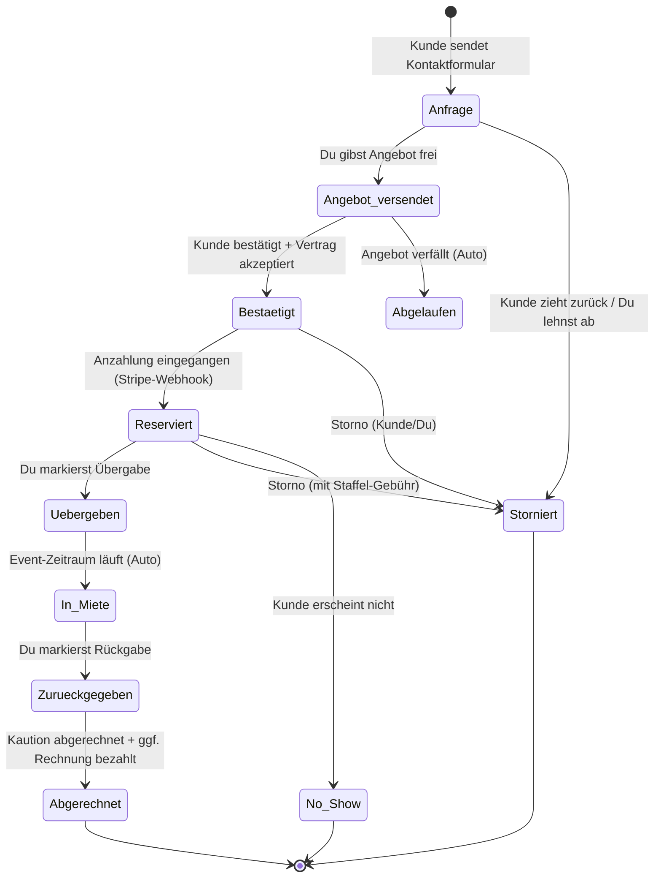
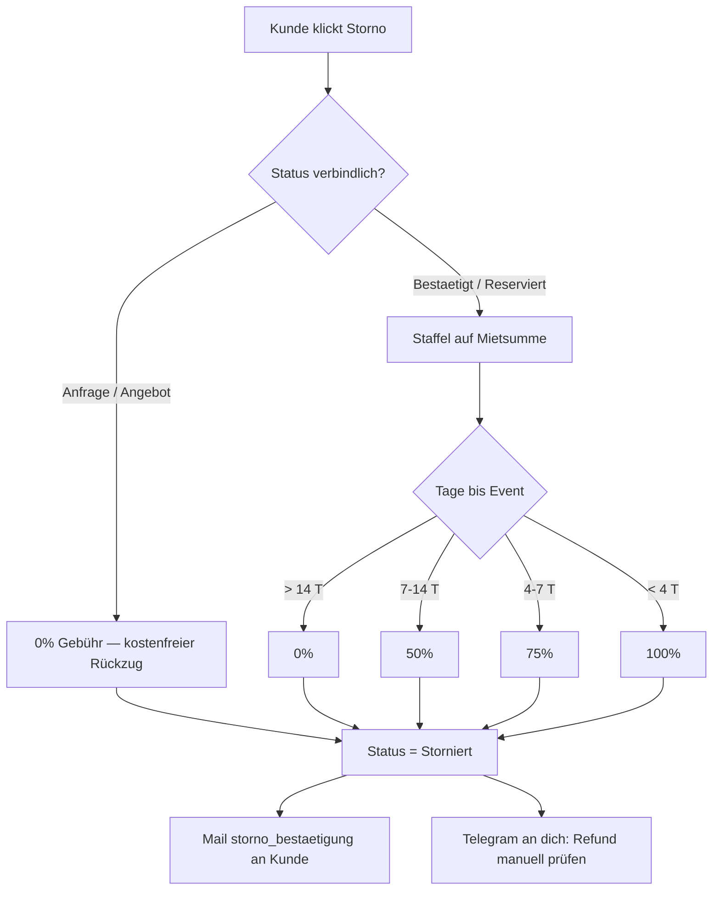

# Eventverleih Bergstraße — Kompletter Ablauf (Customer Journey + Manuels Aktionen)

> Stand: 2026-06-18 · Quelle: Code-Trace des Repos (kein geratenes Wissen).
> Zweck: An jeder Stelle klar machen, **was passiert, welche Mail rausgeht und was DU wann tun musst.**
> Schwester-Dokument: `Audit 2026-06-18 Maengelliste.md` (gefundene Fehler + Fixes).

---

## 1. Status-Maschine einer Buchung

**Verbindlichkeit:** Ein Vertrag besteht erst ab **Bestaetigt/Reserviert**. `Anfrage` und `Angebot_versendet` sind unverbindlich → kostenfreier Rückzug, keine Stornogebühr.

**Verfügbarkeit blockiert** ab `Bestaetigt` (weich) bzw. hart ab `Reserviert/Uebergeben/In_Miete`. `Reserviert` = Anzahlung ist da = first-to-pay-wins.

---

## 2. Der Ablauf Schritt für Schritt

Legende Mail-Versand:
- **Auto** = geht sofort automatisch raus (n8n-Poll ~60 s), du musst nichts tun.
- **Freigabe nötig** = liegt im Dashboard als „Pending", **du klickst Freigeben oder Ablehnen**.
- **— ** = keine Mail.

| # | Phase | Auslöser | Wer klickt was | Status danach | Mail (Template) | Versand | 🔔 DEINE Aufgabe |
|---|-------|----------|----------------|---------------|-----------------|---------|------------------|
| 1 | **Anfrage** | Kunde füllt Kontaktformular (`/` → Contact) | Kunde sendet ab | `Anfrage` | `anfrage_eingang` | Auto | Anfrage im Dashboard `/admin/anfragen` prüfen |
| 2a | **Angebot freigeben** | Du im Anfrage-Detail | Button „Angebot freigeben" (optional Anmerkung) | `Angebot_versendet` | `angebot_freigegeben` (+`_anmerkung`) | Auto (Approved) | Preise/Positionen vorher prüfen |
| 2b | **Rückruf** | Du | Button „Rückruf vorschlagen" | bleibt `Anfrage` | `rueckruf_vorschlag` | Auto | — |
| 2c | **Ablehnen** | Du | Button „Anfrage ablehnen" (Grund, optional „ohne Mail") | `Storniert` | `anfrage_abgelehnt` | Auto | Grund wählen |
| 3 | **Angebot nachfassen** | Du, ~10 Tage später | Button „Nachhaken" / „Erneut senden" / „Neue Version" | `Angebot_versendet` | `angebot_nachhaken` / `_erneut_gesendet` / `_aktualisiert` | Auto | Optional, nicht zu früh (Cooldown 3 Tage bei Nachhaken) |
| 4 | **Kunde bestätigt** | Kunde auf `/angebot/[token]` | Adresse+Tel eingeben, AGB-Haken, „Angebot bestätigen" | `Bestaetigt` | — (intern Vertrag akzeptiert) | — | — |
| 5 | **Anzahlungs-Erinnerung** | Cron, falls Anzahlung ausbleibt (T-14/-7/-3 / +3 n. Best.) | — | `Bestaetigt` | `anzahlung_pre14/7/3`, `anzahlung_post3` | **Freigabe nötig** | Im Dashboard freigeben (oder ablehnen, falls schon bar gezahlt) |
| 6 | **Anzahlung zahlt ein** | Kunde zahlt Stripe-Link (oder du erfasst Bar/Überw.) | Kunde zahlt / du „Zahlung erfassen" | `Reserviert` | `anzahlung_erhalten` | Auto | Bei Bar/Überweisung: im Buchungs-Detail erfassen |
| 7 | **Restzahlungs-Info** | Cron T-3 vor Event, falls offen | — | `Reserviert` | `restzahlung_pre3` | Auto | — |
| 8 | **Kaution-Hold** | Cron (~T-5) oder manuell | optional Button „Kaution-Mail" | `Reserviert` | `kaution_hold_link` | Auto | — (Kunde hinterlegt Pre-Auth-Hold via Stripe) |
| 9 | **Termin-Erinnerung** | Cron T-1 + 1 h vorher (n8n) | — | `Reserviert` | `termin_erinnerung`, `termin_1h_uebergabe` | Auto | — |
| 10 | **Übergabe** | Vor Ort | Button „Übergabe markieren" (Checkliste, Kaution-Methode, Fotos) | `Uebergeben` → `In_Miete` | `uebergabe_erfolgt` | Auto | **Übergabe dokumentieren** (Fotos = Schadensschutz) |
| 11 | **Rückgabe** | Vor Ort | Button „Rückgabe markieren" (Vollständigkeit, Fotos) | `Zurueckgegeben` | — | — | **Rückgabe dokumentieren**, startet 2-Werktage-Prüffrist |
| 12 | **Kaution abrechnen** | Nach Prüffrist | Button „Vollständig / Teilweise / Einzug" | `Abgerechnet` | `kaution_rueckzahlung` / `_teilerstattung` / `_einzug` | Auto | **Schaden prüfen, abrechnen** (löst Stripe-Hold auf) |
| 13 | **Rechnung** | Optional / bei Überweisung | Button „Rechnung erstellen" / „bezahlt markieren" | `Abgerechnet` | `rechnung_pdf` | Auto | Bei Überweisung „bezahlt" markieren → EÜR-Einnahme |
| 14 | **Bewertung** | Cron, 3–10 Tage nach Event | — | — | `google_review` | **Freigabe nötig** | Im Dashboard freigeben |

---

## 3. Storno — was passiert wann

**Kunde storniert selbst** (`/mein-bereich` → „Buchung stornieren / Anfrage zurückziehen"):

🔔 **DEINE Aufgabe bei Storno mit Erstattung:** Der Stripe-Refund wird **NICHT automatisch** ausgelöst (Sicherheit gegen Fehlbuchung auf Live-Stripe). Du bekommst eine Telegram-Nachricht und triggerst den Refund manuell im Admin (Storno-Dialog, „Stripe-Refund auslösen") oder im Stripe-Dashboard.

**Du stornierst** (Admin Buchungs-Detail → „Stornieren"): Grund wählen, Erstattung (vorbelegt, überschreibbar), optional Stripe-Refund-Haken, Notiz.

---

## 4. Deine Aktions-Map (wann musst DU ran?)

Alles andere läuft automatisch. **Nur diese Punkte brauchen dich aktiv:**

1. **Neue Anfrage** → freigeben / ablehnen / Rückruf (`/admin/anfragen`).
2. **Pending-Mails freigeben** → Anzahlungs-Erinnerungen + Bewertungsbitten liegen als „Pending" im Dashboard-Posteingang (`/admin`, Quadrant „Pending Mails"). Freigeben oder ablehnen.
3. **Bar/Überweisung erfassen** → wenn nicht über Stripe gezahlt wird (Buchungs-Detail → Zahlungs-Panel).
4. **Übergabe** dokumentieren (Fotos!).
5. **Rückgabe** dokumentieren (Fotos!).
6. **Kaution abrechnen** nach der Prüffrist (voll/teil/einzug).
7. **Storno-Refund** manuell auslösen, wenn eine Erstattung fällig ist.
8. **Rechnung „bezahlt"** markieren bei Überweisung (erzeugt die EÜR-Einnahme).

Der Dashboard-Posteingang `/admin` ist als **4-Quadranten-Inbox** gebaut (Pending Mails · offene Restzahlungen · neue Anfragen · Schäden) — das ist deine tägliche „Was ist zu tun"-Ansicht.

---

## 5. Automatische Mails im Überblick (27 Templates)

| Template | Wann | Freigabe? |
|----------|------|-----------|
| `anfrage_eingang` | sofort nach Anfrage | Auto |
| `angebot_freigegeben` / `_anmerkung` | nach deiner Freigabe | Auto |
| `angebot_erneut_gesendet` / `_nachhaken` / `_aktualisiert` | dein Nachfass-Klick | Auto |
| `anfrage_abgelehnt` / `rueckruf_vorschlag` | deine Aktion | Auto |
| `anzahlung_pre14` / `pre7` / `pre3` / `post3` | Cron, Anzahlung offen | **Freigabe** |
| `anzahlung_erhalten` | Zahlungseingang | Auto |
| `restzahlung_pre3` | Cron T-3 | Auto |
| `restzahlung_erhalten` / `komplettzahlung_erhalten` | Zahlungseingang | Auto |
| `kaution_hold_link` | Cron ~T-5 / manuell | Auto |
| `kaution_iban_anfordern` | bei Bar-Kaution | Auto |
| `termin_erinnerung` / `rueckgabe_erinnerung` | Cron T-1 | Auto |
| `termin_1h_uebergabe` / `_rueckgabe` | n8n ~1 h vorher | Auto |
| `kaution_rueckzahlung` / `_teilerstattung` / `_einzug` | deine Kaution-Abrechnung | Auto |
| `storno_bestaetigung` | Storno | Auto |
| `login_magic_link` | Login-Anforderung | Auto |
| `google_review` | Cron 3–10 Tage nach Event | **Freigabe** |

**Versand-Mechanik:** Die App schreibt Mails als Zeilen in die Baserow-**MailQueue** (Tabelle 969). Der n8n-Workflow `eve-mailqueue-poll` (~60 s) versendet alles mit `Auto_Reply` oder `Approved`. `Pending` wartet auf deine Freigabe im Dashboard. Jede Mail hat einen `Idempotency_Key` gegen Doppelversand.

⚠️ **Abhängigkeit:** Steht der n8n-Workflow still, bleiben alle Mails in der Queue hängen (auch die automatischen). Bei „Kunde hat keine Bestätigung bekommen" zuerst n8n prüfen.

---

## 6. Zahlungs- & Kautions-Mechanik (Stripe)

- **Anzahlung 30% / Restzahlung 70%** → normale Stripe-Checkout-Links. Zahlungseingang kommt per **Webhook** (`payment_intent.succeeded`) zurück → Status `Reserviert`, Bestätigungsmail.
- **Kaution** → Stripe-Checkout mit `capture_method=manual` = **Pre-Auth-Hold** (Geld wird beim Kunden nur blockiert, nicht abgebucht). Webhook `amount_capturable_updated` speichert die PaymentIntent-ID.
- **Kaution-Auflösung:**
  - *Voll zurück* → `cancelKaution` (Hold freigeben).
  - *Teilschaden* → `captureKaution(schaden)` (nur Schadensbetrag abbuchen, Rest gibt Stripe frei).
  - *Einzug* → `captureKaution()` (voller Betrag).
- **EÜR:** „Rechnung bezahlt" markieren legt eine Einnahmen-Zeile (Baserow 961) für ELSTER an. Kaution ist **keine** Einnahme (sauber getrennt).

---

## 7. Wichtige Abhängigkeiten (wenn etwas klemmt)

| Wenn … | … dann zuerst prüfen |
|--------|----------------------|
| Kunde bekommt keine Mail | n8n-Workflow `eve-mailqueue-poll` läuft? MailQueue-Row Status? |
| Zahlung kommt nicht im System an | Stripe-Webhook erreichbar + Signatur-Secret korrekt? |
| Verfügbarkeit falsch | Cache (`invalidateAvailabilityCache`) / Sperrzeiten 973 |
| Reminder laufen nicht | Vercel-Crons aktiv? (Hobby-Plan: nur 2 Slots, Rest gebündelt) |
| PDF/Foto fehlt | Vercel-Blob-Quota / n8n-PDF-Render-Webhook |

---

*Dieses Dokument ist Teil des Audits vom 2026-06-18. Bei Mail-/Status-Änderungen am Code bitte mit aktualisieren (wie beim Betriebshandbuch).*
