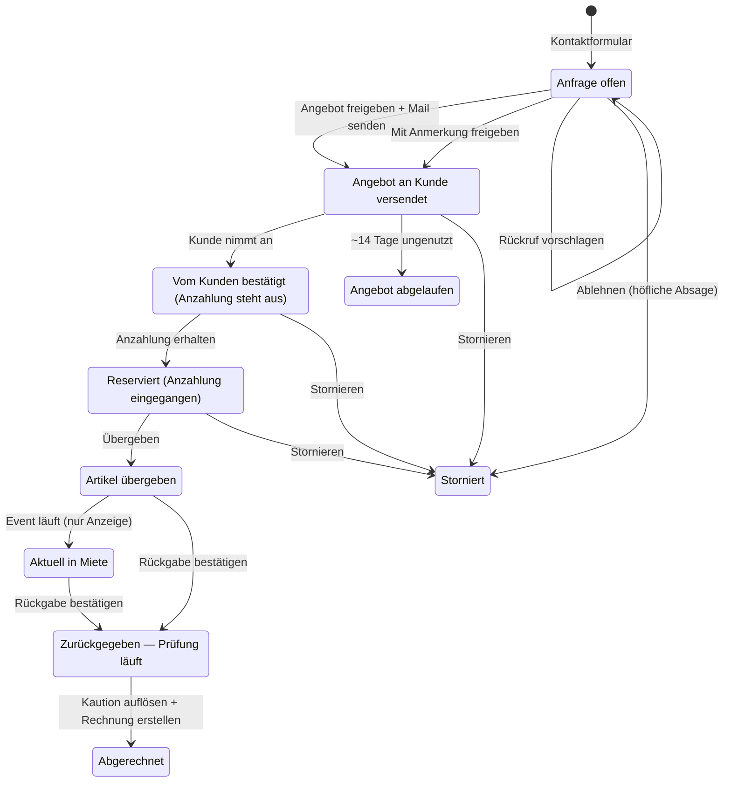
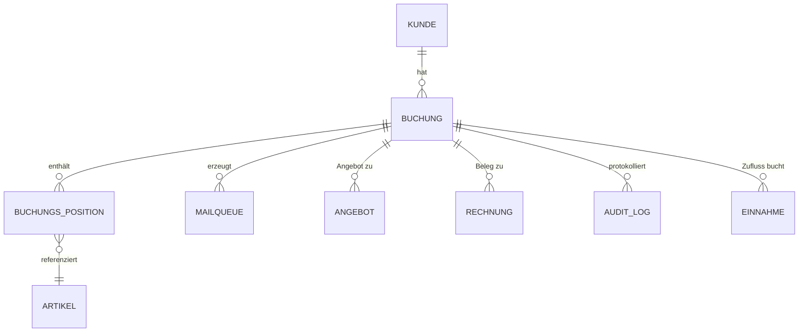

# Eventverleih Bergstraße — Betriebshandbuch (Dashboard & Mail-System)

> **Zweck.** Eine Quelle der Wahrheit dafür, *wann welche E-Mail* an den Kunden geht, *wer sie auslöst* (Klick oder Automatik) und *wo im Code* sie lebt. Teil A erklärt das in Alltagssprache (für Manuel / Dashboard). Teil B ist die Code-Landkarte (für Hermes), damit Mail-Änderungen nicht jedes Mal eine Komplett-Suche brauchen.
>
> **Stand:** 2026-06-24. Beschreibt den **Repo-Code**. Drift-Check: `python3 scripts/handbuch_drift_check.py` vergleicht das Mail-Inventar (Teil B) gegen die echten `Template_Key`s im Code (MailQueue-Mails). Die finale n8n-Direkt-Mail (Rechnung/Abschluss, `eve-rechnung-render-mail`) hat **keinen** Template_Key und liegt außerhalb des Checks — separat pflegen.
>
> ⚠️ **Drift-Warnung:** Produktion lief in der Vergangenheit Code, der in keinem lokalen Commit stand (Mail-Betreffe, die nirgends im Repo auffindbar waren). Wenn eine real zugestellte Mail von diesem Dokument abweicht: nicht annehmen Repo == Prod. Mit `git grep "<Betreff>" $(git rev-list --all)` über *alle* Commits suchen und gegen die **Live-Baserow-Rows** (Tabelle MailQueue) prüfen.
>
> 🔧 **Wartungsregel (wichtig):** Wird eine Mail geändert, hinzugefügt oder entfernt → **die Tabelle in Teil B im selben Commit mitpflegen.** Genau das spart künftig die Code-Sucherei.
>
> 📎 **Verwandte Dokumente (eigene Quellen, hier nur verlinkt):** Corporate-Design / Brand-Guide (Logo, Farben, Fonts — eigenes Dokument) · Decision-Log (Warum-Entscheidungen) · Inhalts-Vorlagen als „edit → live"-Daten (Mail-Texte, Mietvertrag, AGB, Datenschutz, FAQ, Rechnungs-/Angebots-Layout). Diese Texte gehören NICHT ins Handbuch dupliziert — das Handbuch sagt nur, wo sie leben.

---

## Teil A — Was passiert wann? (für Manuel)

### Wie Mails rausgehen — vier Arten

Jede Kundenmail geht auf eine von vier Arten raus (die technischen Bezeichnungen dazu stehen in Teil B):

| Art | Was es bedeutet |
|---|---|
| **Wartet auf deine Freigabe** | Geht erst raus, wenn du sie im Backoffice freigibst. |
| **Sofort automatisch** | Geht ohne dein Zutun raus (z. B. Eingangsbestätigung, Zahlungsbestätigung) — meist innerhalb einer Minute. |
| **Mit deiner Aktion** | Eine Aktion von dir (z. B. „Angebot freigeben") ist zugleich die Freigabe → geht sofort raus. |
| **Abgelehnt** | Wird nie versendet. |

Faustregel: „Wartet auf deine Freigabe" = du schaust nochmal drüber · „Sofort automatisch / Mit deiner Aktion" = läuft von selbst, du musst nichts tun.

### Der Lebenszyklus einer Buchung (Zeitstrahl)

Eine Buchung durchläuft diese Zustände (so heißen sie auch im Status-Panel):
Anfrage offen → Angebot an Kunde versendet → Vom Kunden bestätigt → Reserviert → Artikel übergeben → (Aktuell in Miete) → Zurückgegeben → Abgerechnet.
Seitenpfade: Angebot abgelaufen, Storniert, Kunde nicht erschienen.

```
①  ANFRAGE
    Kunde füllt Website-Formular aus
    → Auto: Eingangsbestätigung an den Kunden
    Du im Dashboard — Schnellaktionen in der Anfragen-Liste: „Freigeben" · „Mit Anmerkung" · „Rückruf" · „Ablehnen"
    (im Anfrage-Detail ausführlicher: „Angebot freigeben + Mail senden", „Mit Anmerkung freigeben", „Rückruf vorschlagen", „Ablehnen (höfliche Absage)")

②  ANGEBOT VERSENDET
    Du klickst „Angebot freigeben + Mail senden"
    → Mail: Angebot an Kunden
    → Dabei entstehen bereits die Stripe-Zahllinks (Anzahlung/Rest/Komplett); der Kaution-Hold kommt erst später.
    Bleibt aktiv bis Annahme ODER Eventdatum verstreicht.
    Läuft es ungenutzt ab → STILL (keine Kundenmail).
    Nach ~10 Tagen ohne Reaktion: Schnellaktion „Nachhaken" (freundliche Erinnerung; NICHT das Angebot 1:1 neu schicken).
    Kunde hat die Mail verloren? → „Mail verloren? Erneut senden" (sendet unverändert).
    Preise/Daten geändert? → aktualisierte Version über „Senden als v2" (Update-Mail an den Kunden).

③  ANZAHLUNG / BESTÄTIGT → RESERVIERT
    Kunde zahlt Anzahlung (Stripe) oder du erfasst Überweisung manuell
    → Auto: „Anzahlung erhalten — Ihr Termin ist reserviert"
    (Komplettzahlung möglich → Auto: „Zahlung erhalten — vollständig bezahlt")
    Erst ab Anzahlung sind die Artikel reserviert.
    Cron schickt ggf. Anzahlungs-Reminder (T-14/-7/-3 vor Event, oder 3 Tage nach Bestätigung) — als Pending, du gibst frei.

④  VOR DEM TERMIN
    Kaution-Hold-Link: manuell (Button) oder Auto-Cron (T-5 vor Event) → Auto
    Restzahlungs-Info (T-3) → Auto
    Termin-Erinnerung Übergabe (T-1) → Auto
    1 Stunde vor Übergabe „Gleich: Ihr Termin um …" → Auto (Schedule alle ~15 Min)

⑤  ÜBERGABE
    Übergabe-Ort: bei Selbstabholung der feste Treffpunkt Grillhütte Sandwiese; bei Lieferung an die Event-Adresse des Kunden.
    Du dokumentierst die Übergabe im Dialog „Übergabe Buchung #…": Checkliste „Übergeben (x/y)" abhaken,
    Fotos (optional) — und die Kaution-Methode wählen: „Bar erhalten" / „Stripe-Hold" / „Noch offen" — dann „Übergeben".
    → Auto: „Übergabe erfolgt — Ihre Mietartikel"
    Status: „Artikel übergeben" (Anzeige „Aktuell in Miete", sobald das Event läuft)

⑥  VOR / BEI RÜCKGABE
    Termin-Erinnerung Rückgabe (T-1) → Auto
    1 Stunde vor Rückgabe → Auto
    Du dokumentierst die Rückgabe („Rückgabe bestätigen") → Status: „Zurückgegeben — Prüfung läuft"

⑦  KAUTION (intern, KEINE eigene Mail — seit 2026-06-24)
    Du prüfst Kaution + Schäden. Die Prüffrist (1–2 Werktage) wird automatisch gesetzt.
    Im Panel „Kaution-Prüfung offen" klickst du auf „Kaution erstatten / einbehalten" — dann öffnet sich die Auswahl:
      · „Volle Erstattung (kein Schaden)" → der Stripe-Hold wird freigegeben, dem Kunden wird nichts abgebucht.
      · „Teilerstattung — Schaden eingezogen" → du gibst die Schadensumme ein; nur der Schaden wird eingezogen, der Rest fällt weg.
      · „Kompletter Einzug (Schaden >= Kaution)" → die ganze Kaution wird einbehalten.
    Danach klickst du „Kaution auflösen (ohne Mail)". Es geht KEINE eigene Mail raus — die Kaution-Info erscheint später in der Abschluss-Mail (⑧).
    Bar-Kaution (ohne Stripe-Hold): „IBAN für Rücküberweisung anfordern" — du fragst den Kunden nach seiner IBAN und überweist die Kaution manuell per Bank-App zurück.
    Status: Abgerechnet

⑧  ABSCHLUSS-MAIL — Rechnung + Kaution + Bewertung in EINER Mail
    Button „Rechnung erstellen + Mail senden" (du löst sie bewusst aus).
    → n8n eve-rechnung-render-mail: Rechnungs-/Beleg-PDF (benannt `RG-<Nr>.pdf`)
      + Kaution-Status + Google-Bewertungsbitte. Erfüllt den Wunsch „eine warme Abschluss-Mail".
    Timing-Gate: Kaution zuerst auflösen (⑦), dann Abschluss-Mail — nie Bewertung bei offener Kaution.
```

### Lebenszyklus als Zustandsdiagramm



Hinweise: Die Kästen tragen die **Status-Namen wie im Dashboard**. Beim Reinkommen einer Anfrage hast du **alle vier Aktionen zusammen** vor dir (Angebot freigeben + Mail senden / Mit Anmerkung freigeben / Rückruf vorschlagen / Ablehnen). „Angebot erstellt" ist ein interner Entwurf-Zwischenstatus (vor dem Versand) und im Bedienablauf nicht relevant. „Aktuell in Miete" ist nur eine datumsbasierte Anzeige (kein eigener Umschalt-Schritt). Jeden Status kannst du im Status-Panel notfalls manuell setzen.

### Zahllinks & Kaution-Hold — wann entstehen sie

Wichtiger Schritt, der im reinen Status-Bild fehlt — in Alltagssprache:

- **Anzahlungs-, Restzahlungs- und Komplettzahlungs-Link** entstehen **automatisch**: sobald du das **Angebot freigibst**, und nochmal, wenn der **Kunde annimmt**. Bei Bedarf erzeugst du sie jederzeit neu über das Panel „Stripe-Zahlungslinks". Sobald der Kunde zahlt, springt die Buchung von selbst auf „Reserviert (Anzahlung eingegangen)".
- **Kaution-Hold** entsteht **nicht** beim Angebot/bei der Annahme, sondern **später**: bei der **Übergabe** (wenn du dort „Stripe-Hold" wählst), per Button „Kaution-Hold-Link an Kunden mailen", oder automatisch ~5 Tage vor dem Event. Aufgelöst wird er nach der Rückgabe über „Kaution auflösen".

(Die technischen Details dazu — Routen, Webhook-Ereignisse, Feldnamen — stehen in Teil B, nicht hier.)

### Dauerhafte Geschäftsregeln (gelten projektweit)

- **Stripe ist der Standard-Zahlweg, Bargeld ist die Ausnahme** (Manuel, 2026-07-23 — verbindlich).
  Gilt für Anzahlung, Restzahlung **und Kaution** (Kaution als Pre-Authorization/Hold: es wird nichts
  abgebucht, solange kein Schaden vorliegt). Fehlt ein Zahlungslink, wird er **erzeugt**, statt auf bar
  auszuweichen.
  Bar bleibt möglich — aber nur im Notfall, nach telefonischer Rücksprache oder wenn ein Kunde von sich
  aus darauf besteht. Dann still ermöglichen. **In keinem Kundentext wird Bargeld von sich aus
  angeboten**, auch nicht als freundliche Wahlmöglichkeit („bar oder online, wie Sie möchten") — genau
  diese Gleichstellung ist das, was abgeschafft wurde. Grund: Manuel will kein Bargeld hantieren
  (Wechselgeld, Verwahrung, Einzahlung, Zuordnung von Hand).
  ⚠️ Diese Regel wurde schon einmal getroffen (Commit `6d04d99`, 2026-06-04) und ging verloren, weil sie
  nur in der Commit-Nachricht stand: Auf `main` sagt der Termin-Reminder weiterhin „diese wird bar bei
  der Übergabe erhoben", und am 2026-07-19 ging real eine `kaution_bar_hinweis`-Mail raus. Beim nächsten
  Anfassen eines Zahlungstextes gegenprüfen, ob der Code die Regel wirklich abbildet.
  Volle Entscheidung: Vault `Decisions/2026-07-23-stripe-standard-bar-ausnahme.md`.
- **Kaution = durchlaufender Posten / Sicherheit, KEINE Einnahme.** Nie auf die Mietrechnung, nie abgezogen. Schäden separat über die Kaution, nicht über die Mietsumme.
- **Refund-Methode folgt der Zahlungsmethode.** Stripe-bezahlt → Stripe-Refund (Button löst Auto-Mail aus). Bar/Überweisung → manuelle (Termin-)Überweisung, **nie** Stripe-Refund.
- **Zahlungsgebühren nie an den Kunden weitergeben** (§270a BGB). Entfällt eine bezahlte Leistung → volle Differenz erstatten, ohne Gebühren-Abzug.
- **Rechnung nach der Rückgabe** (Leistung erbracht), **entkoppelt** von der Kautionsrückzahlung — nicht darauf warten.
- **Offene Kautionsrückzahlung = Buchung gilt NICHT als abgeschlossen** (bleibt offene Aktion bis erstattet).
- **Positionen ändern nach Rechnungsstellung: gesperrt** (seit 2026-07-23). Sobald für eine Buchung eine
  Rechnung existiert, verschwinden im Buchungsdetail die Entfernen-Kreuze, und ein direkter API-Aufruf
  wird mit 409 abgelehnt. Grund: Der Rechnungs-Snapshot ist GoBD-eingefroren und ändert sich nicht mit,
  die Buchung schon — ohne Sperre liefe die Buchungssumme still von der ausgestellten Rechnung weg.
  Eine Korrektur nach Rechnungsstellung läuft über eine Storno- oder Korrekturrechnung (existiert noch
  nicht), nicht über stilles Löschen. Entfernte Positionen und Leistungen landen jetzt außerdem im
  Audit-Log (Zustand vor dem Löschen). Volle Entscheidung: Vault
  `Decisions/2026-07-23-positionen-nach-rechnungsstellung-gesperrt.md`.
- **Belegmail geht genau einmal raus, und das ist nachvollziehbar** (seit 2026-07-23). Das Feld
  `Beleg_Mail_am` (Rechnungen 950) hält fest, wann die Belegmail ausgelöst wurde. Der Knopf im
  Buchungsdetail sagt vorher, was er tun wird: „Rechnung erstellen + Mail senden" (neu),
  „Belegmail nachholen" (Rechnung da, noch kein Versand vermerkt) oder „Beleg bereits versendet"
  (gesperrt, mit Datum). Nach dem Klick wird gemeldet, was mit der **Mail** passiert ist, nicht nur,
  dass die Rechnung existiert. **Wichtig zum Lesen des Feldes: LEER heißt UNBEKANNT, nicht „nicht
  verschickt"** — das Feld existiert erst seit dem 23.07.2026. Für die drei Rechnungen davor wurde
  der belegte Versandzeitpunkt aus dem BCC-Postfach nachgetragen; die beiden importierten
  Altbelege ZV-0007_01 und ZV-0008 bleiben leer.
  Hintergrund: Wer den Beleg über „Kaution erstatten" anlegen ließ, konnte danach über den Knopf
  keine Belegmail mehr auslösen — er meldete Erfolg, es passierte nur nichts.
- **Buchung wird beim Rechnung-Erstellen automatisch abgerechnet**, wenn sie auf „Zurueckgegeben" steht,
  die Rechnung bereits bezahlt entsteht **und** keine Kautionsrückzahlung mehr offen ist. Vorher hing
  dieser Übergang allein am Button „Als bezahlt markieren", der bei einer schon bezahlt entstehenden
  Rechnung nie erscheint — deshalb blieben Buchungen trotz bezahlter Rechnung auf „Zurueckgegeben"
  stehen (16, 22, 27 am 2026-07-23 von Hand korrigiert).
- **Angebot läuft still ab** (keine „Angebot abgelaufen"-Mail). Gültigkeit ~14 Tage. Nachhaken erst nach ~10 Tagen, „erneut senden" nur Ausnahme.
- **Mail-Ton:** Erfolgsfall (volle Erstattung) warm + persönlich inkl. Bewertungsbitte; Schadensfälle (Teil/Einzug) sachlich-neutral. Stil-Grundregeln (`schreibstil-manu`) immer durchsetzen.
- **Keine Auto-Kundenmail aus Einzelaktionen** (seit 2026-06-24): Kundenmail bewusst über „Rechnung erstellen + Mail senden", nicht als Nebeneffekt eines Buttons.

### Dashboard-Übersicht (wo finde ich was)

**Backoffice-Startseite** (direkt nach dem Login, Titel „Backoffice"): vier Kästen, was ansteht —
**„Heute zu tun"**, **„Überfällig"**, **„Wartet auf Kunde"** (zeigt je Angebot das Event-Datum) und **„Wartet auf Geld"** (mit Summe). Darüber erscheinen bei Bedarf Banner: Konflikt (knapper Bestand — Entscheidung nötig), „Kunde hat gerade bestätigt — Anzahlung steht aus" und „Mails warten auf Freigabe" (mit Freigeben/Ablehnen direkt).

**Linkes Menü** (immer sichtbar): „Übergaben & Rückgaben" · „Anfragen" · „Buchungen" · „Kunden" · „Rechnungen" · „Finanzen" · „ELSTER-EÜR" · „Produkte" · „Kategorien" · „Aktionen" · „Sperrzeiten".

**„Anfragen":** jede neue Anfrage als Karte, mit den Schnellaktionen direkt dran („✓ Freigeben" · „Mit Anmerkung" · „Rückruf" · „✗ Ablehnen"). Klick öffnet das Detail.

**„Buchungen":** öffnet auf dem Tab **„Aktiv"** (was zu erledigen ist, zuerst), daneben „Anstehend" · „Alle" · „Abgeschlossen" · „Storniert". Tabelle mit Event-Datum, Kunde, Status und Gesamtbetrag; bei Überzahlung ein Guthaben-Hinweis.

**Buchungs-Detailseite** (Klick auf eine Buchung) — von oben nach unten:
1. **Kopf** — „Buchung #…", oben rechts die Knöpfe „Angebot" und „Vertrag" (öffnen die Kundenansichten).
2. **Auf einen Blick** — Kunde + Kontakt, „Miete bezahlt / offen", Kaution-Status, und der zum Status passende **Primär-Knopf** („Übergeben" / „Rückgabe bestätigen" / „… Rechnung erstellen"); darunter Event-, Übergabe- und Rückgabe-Datum.
3. **Termine** — Übergabe-/Rückgabe-Termin + „Termine speichern + Mail senden" (zeigt den Treffpunkt Grillhütte Sandwiese).
4. **Rechnung** — „Rechnung erstellen + Mail senden" (die finale Kundenmail).
5. **Bestellung** — Artikel + Services, je Zeile „Entfernen".
6. **Zahlungen** — Soll/Bezahlt/Offen + „Zahlungseingang erfassen"; Guthaben-Hinweis bei Überzahlung.
7. **Checkliste** — Fortschritt über alle Phasen (Angebot → Zahlung → Übergabe → Rückgabe → Abrechnung), je Punkt mit „AUTO" oder „MANUELL".
8. **Rechnungen** — erstellte Rechnungen (Nummer, Betrag, bezahlt-Status).
9. **Schriftverkehr** — alle an den Kunden gesendeten Mails mit Datum („Alle … E-Mails anzeigen").
10. **Notizen** — Anfrage-Text + Verlauf.
11. **Protokoll** — Übergabe-/Rücknahme-Doku (Checkliste, Fotos, Schäden, Kaution) → „Protokoll ansehen".
12. Ganz unten, **eingeklappt** (nur für Sonderfälle): „Zahlungs-Links & Kaution-Mail (manuell)" (Stripe-Links + Kaution-Hold-Link + Stornieren), „Status manuell setzen (Notfall)" (Status-Override) und „Details (Quelle, Standort, Aufbau)".

**Roter Faden:** Der Primär-Knopf oben (Punkt 2) führt dich durch den Ablauf (Übergeben → Rückgabe bestätigen → Kaution auflösen → Rechnung erstellen). Die **Checkliste** (Punkt 7) zeigt dir jederzeit, wo die Buchung steht. Die eingeklappten Bereiche unten (Punkt 12) brauchst du nur im Ausnahmefall.

### Aktionen & Buttons (exakte Dashboard-Beschriftungen)

Wortgetreu, wie im Dashboard sichtbar — das ist die Fläche, auf die du zeigst, wenn du etwas ändern willst.

**Anfrage — Panel „Aktion wählen":**
- „Angebot freigeben + Mail senden"
- „Mit Anmerkung freigeben" → Textfeld → „Senden mit Anmerkung"
- „Rückruf vorschlagen" (Status bleibt Anfrage)
- „Ablehnen (höfliche Absage)" → Dropdown „Grund (bestimmt den Kundentext)": „Termin/Artikel ausgebucht" · „Außerhalb Liefergebiet" · „Artikel nicht verfügbar" · „Termin zu kurzfristig" · „Möchte nicht vermieten (neutrale Mail)" · „Sonstiges (eigener Kundentext)"; Checkbox „Ohne Mail ablehnen (Test/Spam)"; Button „Absage senden" bzw. „Ablehnen ohne Mail"

**Anfragen-Liste — Schnellaktionen (kürzer beschriftet, gleiche Endpunkte):** „✓ Freigeben" · „Mit Anmerkung" · „Rückruf" · „✗ Ablehnen". Bei Status „Angebot an Kunde versendet" stattdessen: „Nachhaken" · „Mail verloren? Erneut senden" · „✗ Ablehnen". Das Ablehnen-Dropdown der Liste hat 5 Gründe (ohne „Sonstiges"): „Termin/Artikel ausgebucht" · „Außerhalb Liefergebiet" · „Artikel nicht verfügbar" · „Termin zu kurzfristig" · „Möchte nicht vermieten (neutrale Mail)". Neue Angebots-Version über „Senden als v2".

**Buchung — Panel „Status" (über „Notfall-Override"):** Optionen „Anfrage offen" · „Angebot erstellt" · „Angebot an Kunde versendet" · „Reserviert (Anzahlung eingegangen)" · „Vom Kunden bestaetigt (Anzahlung steht aus)" · „Artikel uebergeben" · „Aktuell in Miete" · „Zurueckgegeben — Pruefung laeuft" · „Abgerechnet" · „Storniert" · „Kunde nicht erschienen"; Button „Override speichern (mit Audit-Log)".

**Panel „Termine":** Felder „Übergabe-Termin", „Rückgabe-Termin"; Button „Termine speichern + Mail senden". Eine Bestätigungs-Mail geht **nur** für einen Termin raus, der sich geändert hat **und** in der Zukunft liegt — erneutes Speichern oder das spätere Setzen des Rückgabe-Termins löst **keine** erneute Übergabe-Mail aus.

**Panel „Zahlungseingang erfassen":** Typen „Anzahlung" / „Restzahlung" / „Kaution hinterlegt"; Methode „Bar" / „Überweisung" / „Stripe"; Button „Erfassen".

**Panel „Stripe-Zahlungslinks":** „Stripe-Link für Anzahlung generieren" / „Stripe-Link für Restzahlung generieren"; neu erzeugen über „↻ Neuen Link generieren (alter wird ersetzt)".

**Panel „Kaution-Hold (X €)":** „Kaution-Hold-Link an Kunden mailen" bzw. „Hold-Link erneut an Kunden mailen".

**Dialog „Übergabe Buchung #X" (Button „Übergeben"):** Checkliste „Übergeben (x/y)"; Kaution-Methode „Bar erhalten" / „Stripe-Hold" / „Noch offen"; Fotos; „Notiz (optional, intern)"; Button „Übergeben".

**Dialog „Rückgabe Buchung #X" (Button „Rückgabe bestätigen"):** „Alles zurück?" je Position „Da" / „Fehlt"; Fotos; Button „Rückgabe abschließen".

**Panel „Kaution-Prüfung offen":** „Volle Erstattung (kein Schaden)" / „Teilerstattung — Schaden eingezogen" (Feld „Schaden in € (max …)") / „Kompletter Einzug (Schaden >= Kaution)"; Feld „Schaden-Notiz (erscheint in der finalen Abschluss-Mail)"; Button „Kaution auflösen (ohne Mail)". Bei Bar-Kaution: „IBAN für Rücküberweisung anfordern".

**Abschnitt „Position / Leistung entfernen":** je Zeile Button „Entfernen".

**Panel „Rechnung":** Button „Rechnung erstellen + Mail senden" (bzw. „Weitere Rechnung erstellen") — das ist die EINE finale Kundenmail (Rechnung-PDF + Kaution-Status + Bewertung).

**Dialog „Storno Buchung #X" (Button „Stornieren"):** Grund „Kunden Wunsch" · „Manuel Entscheidung" · „Anzahlung nicht geleistet" · „Konflikt verloren" · „No Show" · „Sonstig"; Feld „Erstattung in EUR"; Checkbox „Stripe-Refund auslösen"; Button „Stornieren".

**Buchungsliste:** Tab „Aktiv" als Default; Guthaben-Badge „Guthaben X € — Rückzahlung offen" bei Überzahlung.

> Wartungsregel: Diese Labels sind 1:1 aus den UI-Komponenten gezogen. Ändert sich ein Button-Text im Code, hier mitziehen — und umgekehrt: was hier steht, ist die SOLL-Beschriftung im Dashboard.

---

## Teil B — Code-Landkarte (für Hermes)

### MailQueue-Mechanik

- **Baserow-Tabelle:** `MailQueue` = **969** (definiert in `src/lib/baserow/client.ts`, Konstante `TABLES`).
- **Schreiben:** Routen/Reminder legen eine Row mit `createRow(TABLES.MailQueue, { Template_Key, Approval_Status, … })` an. Idempotency-Key (Buchungs-ID + Template + ggf. Datum/Suffix) verhindert Doppel-Versand; manuelle Erfassung und Stripe-Webhook teilen sich denselben Key.
- **Versenden:** n8n-Schedule **`eve-mailqueue-poll`** holt die Queue ~jede Minute ab und versendet alles mit `Auto_Reply`/`Approved`. `Pending` bleibt liegen bis Freigabe über `POST /api/admin/mailqueue/[id]/approve` (bzw. `…/reject`).
- **Texte:** Betreff + Body liegen derzeit **inline** in der jeweiligen Route/Reminder-Datei (kein zentrales Template-Verzeichnis). Bei Text-Änderung also in der unten genannten Datei:Zeile editieren.

### Stripe-Webhook — erforderliche Events (Dashboard-Config!)

- **Endpoint:** `https://eventverleih-bergstrasse.de/api/stripe/webhook` (Handler `src/app/api/stripe/webhook/route.ts`). **Kein** programmatisches Setup im Repo — die abonnierten Events werden **manuell im Stripe-Dashboard** gepflegt. Beim Neuaufsetzen/Key-Wechsel müssen daher ALLE folgenden Events am Endpoint aktiviert sein, sonst läuft der jeweilige Handler-Zweig nie:
  | Event | Wofür | Folge bei Fehlen |
  |---|---|---|
  | `payment_intent.succeeded` | Anzahlung/Rest/Komplettzahlung verbuchen | Zahlung kommt nicht im System an |
  | `payment_intent.amount_capturable_updated` | **Kaution-Hold platziert** → `Stripe_Kaution_PaymentIntent` + `Kaution_Hinterlegt_am` setzen | Hold liegt in Stripe (`requires_capture`), bleibt aber in Baserow unsichtbar; „Kaution erstatten/einbehalten" findet die PI nicht |
  | `payment_intent.canceled` | Kaution-Hold-Abbruch | Stornierter Hold nicht reflektiert |
  | `charge.refunded` | Storno-Refund-Marker | Refund nicht markiert |
- **Vorfall 2026-06-19:** `amount_capturable_updated` war **nicht** aboniert → alle je platzierten Kautions-Holds (B16, B27) blieben in Baserow leer. Event nachträglich abonniert; B16/B27 manuell nachgetragen. Bei „Kaution wird nicht angezeigt" zuerst hier prüfen.
- **Diagnose Kaution-Hold (Stripe):** Hold = PaymentIntent mit `capture_method: manual`, erscheint **nicht** als Einnahme, sondern unter Payments als `requires_capture`/„Nicht erfasst". Suche: PaymentIntent-Search `status:'requires_capture'` bzw. `metadata['buchung_id']:'<id>'` (Charges-Suche findet Holds NICHT). Stripe-Secret liegt nur in der **Vercel-Prod-Env** (nicht in Master-.env) → `vercel env pull` mit `VERCEL_TOKEN`.

### Einnahmen / Finanzen-Reiter (Zuflussprinzip, Modell A — ab 2026-06-19)

- **Finanzen-Reiter** (`/admin/finanzen`) liest ausschließlich Tabelle **Einnahmen (961)** + **Ausgaben (962)**, Jahres-gefiltert (Default = laufendes Jahr). Leer = es gibt keine Einnahmen-Rows fürs Jahr.
- **Regel:** Eine Einnahme entsteht beim **Geldzufluss** (§ 11 EStG), NICHT bei Rechnungserstellung. Gebucht über Helper `bucheEinnahme()` (`src/lib/eventverleih/einnahme.ts`), idempotent über Marker `[evt:B<buchungId>:<quelle>]` in `Notizen`.
  - Stripe-Webhook bucht Anzahlung/Restzahlung/Komplettzahlung (quelle = PI-ID). **Kaution NICHT** (Hold = kein Zufluss).
  - Manuelle Zahlungserfassung (`…/buchung/[id]/zahlung`, Bar/Überweisung) bucht ebenso, pro Eingang (quelle = `<typ>-<erfasst_am>`, Teilzahlungen möglich).
  - `…/rechnung/[id]/bezahlt` bucht nur noch als **Fallback** den noch ungedeckten Rest (`gebuchteEinnahmenSumme`) → keine Doppel-/Fehlbuchung bei gemischten Zahlungswegen.
  - **Kautions-Schaden-Einzug** (`kaution-erstatten` teil/einzug) bucht den einbehaltenen Betrag als Einnahme (Schadensersatz, quelle `schaden-<id>`).
  - **Erstattung/Storno** (`charge.refunded`-Webhook) bucht eine **negative Einnahme** (Gegenbuchung zur ursprünglichen Zahlung; quelle `refund-<chargeId>-<betrag>`, Delta-sicher bei Teil-Refunds). `Storno_Betrag_Eur` bleibt die Stornogebühr und wird NICHT überschrieben.
  - `bucheEinnahme()` erlaubt negative Beträge (Erstattung); Idempotenz weiterhin über den Notizen-Marker. Bekannte Grenze: Marker-Check ist nicht atomar (TOCTOU) — bei sehr seltener paralleler Webhook-Re-Delivery theoretisch Doppelbuchung; in der Praxis durch die vorgelagerten Status-Guards abgefangen.
- **Vorher-Bug (behoben 2026-06-19):** Einnahme entstand nur über „Rechnung als bezahlt markieren". Da Stripe-Vorkasse die Rechnung direkt mit Status „Bezahlt" anlegt, lief der Pfad nie → 2026-Einnahmen = 0 trotz echter Zahlungen. Bestand per Backfill aus den realen Zahlungen nachgetragen.

### Mail-Inventar (alle 30, nach Lebenszyklus-Phase)

Spalten: **Auslöser · Sendemodus · Datei:Zeile · `Template_Key` · Betreff**

#### Anfrage / Angebot
| Mail | Auslöser | Modus | Datei:Zeile | Template_Key |
|---|---|---|---|---|
| Eingangsbestätigung | Website-Formular `POST /api/contact` | `Auto_Reply` | `api/contact/route.ts:434` | `anfrage_eingang` |
| Angebot freigegeben | Aktion `freigeben` | `Approved` | `api/admin/anfrage/[id]/action/route.ts:206` | `angebot_freigegeben` |
| Angebot freigegeben + Anmerkung | Aktion `freigeben_anmerkung` | `Approved` | `api/admin/anfrage/[id]/action/route.ts:206` | `angebot_freigegeben_anmerkung` |
| Rückruf-Vorschlag | Aktion `rueckruf` | `Approved` | `api/admin/anfrage/[id]/action/route.ts:219` | `rueckruf_vorschlag` |
| Anfrage abgelehnt | Aktion `ablehnen` | `Approved` | `api/admin/anfrage/[id]/action/route.ts:224` | `anfrage_abgelehnt` |
| Angebot erneut gesendet | `POST …/angebot/[id]/erneut-senden` | `Approved` | `api/admin/angebot/[id]/erneut-senden/route.ts:131` | `angebot_erneut_gesendet` |
| Angebot nachhaken (~T+10) | `POST …/angebot/[id]/nachhaken` | `Approved` | `api/admin/angebot/[id]/nachhaken/route.ts:115` | `angebot_nachhaken` |
| Angebot neue Version | `POST …/angebot/[id]/neue-version` | `Approved` | `api/admin/angebot/[id]/neue-version/route.ts:123` | `angebot_aktualisiert` |
| Angebot angenommen — Bestätigung | Kunde nimmt an `POST /api/vertrag-akzeptieren` | `Auto_Reply` | `api/vertrag-akzeptieren/route.ts:418` | `vertrag_bestaetigung` |

#### Zahlung
| Mail | Auslöser | Modus | Datei:Zeile | Template_Key |
|---|---|---|---|---|
| Anzahlung erhalten | Stripe-Webhook `payment_intent.succeeded` (anzahlung) **oder** manuelle Erfassung `…/buchung/[id]/zahlung` | `Auto_Reply` | `lib/eventverleih/zahlungsbestaetigung.ts:35` | `anzahlung_erhalten` |
| Komplettzahlung erhalten | Stripe-Webhook (komplettzahlung) | `Auto_Reply` | `api/stripe/webhook/route.ts:113` | `komplettzahlung_erhalten` |
| Restzahlung erhalten | Stripe-Webhook (restzahlung) | `Auto_Reply` | `api/stripe/webhook/route.ts:257` | `restzahlung_erhalten` |

#### Reminder (Cron-gesteuert)
| Mail | Auslöser | Modus | Datei:Zeile | Template_Key |
|---|---|---|---|---|
| Anzahlungs-Reminder T-14 | Cron `restzahlung-reminder` | `Pending` | `lib/eventverleih/anzahlung-reminder.ts:186` | `anzahlung_pre14` |
| Anzahlungs-Reminder T-7 | Cron `restzahlung-reminder` | `Pending` | `lib/eventverleih/anzahlung-reminder.ts:186` | `anzahlung_pre7` |
| Anzahlungs-Reminder T-3 | Cron `restzahlung-reminder` | `Pending` | `lib/eventverleih/anzahlung-reminder.ts:186` | `anzahlung_pre3` |
| Anzahlungs-Reminder T+3 n. Bestätigung | Cron `restzahlung-reminder` (Status=Bestaetigt) | `Pending` | `lib/eventverleih/anzahlung-reminder.ts:186` | `anzahlung_post3` |
| Restzahlung-Info T-3 | Cron `restzahlung-reminder` (Status=Reserviert) | `Auto_Reply` | `api/cron/restzahlung-reminder/route.ts:168` | `restzahlung_pre3` |
| Termin-Erinnerung Übergabe T-1 | Cron `restzahlung-reminder` (Sub-Pass) | `Auto_Reply` | `lib/eventverleih/termin-reminder.ts:156` | `termin_erinnerung` |
| Termin-Erinnerung Rückgabe T-1 | Cron `restzahlung-reminder` (Sub-Pass) | `Auto_Reply` | `lib/eventverleih/termin-reminder.ts:214` | `rueckgabe_erinnerung` |
| Termin 1 h vor Übergabe | Cron `termin-1h-reminder` (~alle 15 Min) | `Auto_Reply` | `api/cron/termin-1h-reminder/route.ts:111` | `termin_1h_uebergabe` |
| Termin 1 h vor Rückgabe | Cron `termin-1h-reminder` | `Auto_Reply` | `api/cron/termin-1h-reminder/route.ts:111` | `termin_1h_rueckgabe` |
| Bewertungsbitte (Google) | Cron `kaution-reminder` Sub-Pass `runReviewReminder` (3–10 T nach Event) | `Pending` | `lib/eventverleih/review-reminder.ts:99` | `google_review` |

#### Termin / Übergabe
| Mail | Auslöser | Modus | Datei:Zeile | Template_Key |
|---|---|---|---|---|
| Übergabe-Termin bestätigt | `POST …/buchung/[id]/termin` (uebergabe_termin) | `Approved` | `api/admin/buchung/[id]/termin/route.ts:103` | `termin_uebergabe_bestaetigung` |
| Rückgabe-Termin bestätigt | `POST …/buchung/[id]/termin` (rueckgabe_termin) | `Approved` | `api/admin/buchung/[id]/termin/route.ts:103` | `termin_rueckgabe_bestaetigung` |
| Übergabe erfolgt | `POST …/buchung/[id]/uebergabe` | `Auto_Reply` | `api/admin/buchung/[id]/uebergabe/route.ts:152` | `uebergabe_erfolgt` |

#### Kaution
| Mail | Auslöser | Modus | Datei:Zeile | Template_Key |
|---|---|---|---|---|
| Kaution-Hold-Link | `POST …/buchung/[id]/kaution-mail` (manuell) **oder** Cron `kaution-reminder` (T-5) | `Auto_Reply` | `lib/eventverleih/kaution-mail.ts:124` | `kaution_hold_link` |
| Kaution IBAN anfordern (Bar) | `POST …/buchung/[id]/kaution-iban-anfordern` | `Approved` | `api/admin/buchung/[id]/kaution-iban-anfordern/route.ts:77` | `kaution_iban_anfordern` |
| Kaution-Barzahlungs-Hinweis | Cron `kaution-reminder` (T-3 bis T-1 vor Übergabe, wenn Kaution-Soll > 0 und kein Hold-Link) | `Auto_Reply` | `api/cron/kaution-reminder/route.ts:108` | `kaution_bar_hinweis` |

> **Hinweis (2026-06-24):** Die früheren Kaution-Erstattungs-Mails (`kaution_rueckzahlung`/`_teilerstattung`/`_einzug`) sind **entfernt**. „Kaution auflösen" ist jetzt rein intern; die Kaution-Info läuft über die Abschluss-Mail (siehe nächster Abschnitt).

#### Abschluss / Rechnung (n8n-Direktversand — NICHT MailQueue, kein Template_Key)
| Mail | Auslöser | Modus | Pfad | Hinweis |
|---|---|---|---|---|
| Rechnung + Beleg-PDF | Button „Rechnung erstellen + Mail senden" → `createRechnungForBuchung(sendMail:true)` | n8n-Direkt | n8n `eve-rechnung-render-mail` (Webhook `N8N_RECHNUNG_PDF_URL`) | PDF benannt `RG-<Nr>.pdf` (Node „PDF benennen"); enthält **Kaution-Status** + **Google-Bewertungsbitte**. Liegt außerhalb des Drift-Checks. |

#### Sonstiges / Member
| Mail | Auslöser | Modus | Datei:Zeile | Template_Key |
|---|---|---|---|---|
| Storno-Bestätigung | `POST /api/member/buchung/[id]/storno` (Kunde) | `Auto_Reply` | `api/member/buchung/[id]/storno/route.ts:126` | `storno_bestaetigung` |
| Login Magic-Link | `POST /api/member/login-link` | `Auto_Reply` | `api/member/login-link/route.ts:56` | `login_magic_link` |

### Status-Felder (Buchung)

- **Haupt-Status:** `Status_Erweitert` → `Anfrage · Angebot_versendet · Abgelaufen · Bestaetigt · Reserviert · Uebergeben · In_Miete · Zurueckgegeben · Abgerechnet · Storniert · No_Show`
- **Termine:** `Uebergabe_Termin`, `Rueckgabe_Termin` (ISO-DateTime)
- **Zahlung:** `Anzahlung_Bezahlt_am/_Eur`, `Restzahlung_Bezahlt_am/_Eur`
- **Kaution:** `Kaution_Soll_Eur`, `Kaution_Hinterlegt_am`, `Kaution_Rueckzahlung_am`, `Stripe_Kaution_PaymentIntent`, `Kaution_Pruefung_Status`, `Kaution_Prueffrist_bis`
- **Schaden:** `Schaden_Betrag_Eur`, `Schaden_Dokumentiert_am`
- **Storno:** `Storno_am`, `Storno_Stufe`, `Storno_Betrag_Eur`, `Storno_Grund`
- **Engpass-Flag:** `Konflikt_Mit_Buchung_ID`

### Daten-Landkarte (Entitäten + Verknüpfungen)

Konzeptionelle Karte — Tabellen-IDs + Beziehungen, NICHT die vollständigen Felder (die leben in Baserow; nur logik-treibende Felder stehen unter „Status-Felder").



Tabellen (Baserow): Kunden 949 · Rechnungen 950 · Buchungen 951 · Angebote 952 · EmailLog 953 · System_Konfiguration 955 · Artikel 957 · Einnahmen 961 · Buchungs_Position 968 · MailQueue 969 · Audit_Log 970. Kern: alles hängt an der **Buchung (951)**; Mietsumme + Kaution-Soll werden aus den Positionen (`Buchungs_Position` → `Artikel`) per `recalcBuchung` berechnet.

### Storefront-Katalog: Datenquelle = Baserow (seit 2026-07 — vorher Vercel Blob)

Der öffentliche Produktkatalog (Menü **Produkte · Kategorien · Aktionen** im Admin, sowie die
öffentliche Sortiment-Seite) liest **und schreibt** seit der Blob→Baserow-Migration ausschließlich
über `src/lib/baserow-data.ts` (ersetzt das alte `src/lib/blob-data.ts`, das an Vercel-Blob hing und
bei gesperrtem Store still leer lief). **Es gibt keine `products.json` mehr.**

- **Produkte** = **dieselbe** `Artikel`-Tabelle (**957**) wie das Buchungssystem — **eine** Quelle der
  Wahrheit, kein Zweit-Katalog. Sichtbar auf der Website sind nur Zeilen mit `Sichtbar_Public = true`.
  Website-Felder der Zeile: `Beschreibung` (Freitext), `Bild_URL` (Hauptbild) + `Bild_URLs_weitere`
  (JSON-Array weiterer Bilder), `Youtube_Link`, `Pinned`. Der im Admin editierte **Preis** schreibt
  direkt `Mietpreis_WE_Eur` (kein separater Anzeige-Preis mehr → kein Drift zwischen Website und Buchung).
- **Website-Kategorie** (zelte/tische/beleuchtung/deko) wird im Code aus dem Artikel-Feld `Kategorie`
  (9 Werte) abgeleitet: Zelt+Zubehoer+Gewicht→zelte · Tisch+Stuhl→tische · Beleuchtung+Heizung→beleuchtung
  · Deko+Spiel→deko. Kein eigenes Website-Kategorie-Feld an der Zeile.
- **Kategorien-Liste, Aktionen/Promotions, Storefront-Settings** liegen als Key/Value-Zeilen in
  `System_Konfiguration` (**955**): `website.categories` (JSON), `website.promotions` (JSON),
  `website.whatsapp` / `website.instagram` / `website.hero_image`. Telefon/E-Mail der Storefront kommen
  aus den kanonischen Zeilen `Telefon` / `Email` derselben Tabelle.
- **Bilder:** Bestandsbilder liegen statisch im Repo (`public/images/products/…`) und sind als Pfad in
  `Bild_URL`/`Bild_URLs_weitere` hinterlegt. **Neu** über den Admin hochgeladene Bilder gehen in den
  Baserow-User-File-Store (öffentliche Media-URL) — kein Vercel-Blob mehr.
- **Fehler werden nicht mehr verschluckt:** ist Baserow nicht erreichbar, liefert `/api/products` einen
  echten Fehler statt still einen leeren/Seed-Katalog (das stille Leerlaufen hatte die Blob-Sperre
  wochenlang unsichtbar gemacht). Health-Check: `GET /api/health` (prüft Baserow-Erreichbarkeit, 503 bei Ausfall).
- **Angebots-/Rechnungs-PDFs (`api/internal/store-pdf`, seit 2026-07 auf Baserow):** Der n8n-Render-Flow
  postet die gerenderte PDF an diesen Endpoint; sie wird in den Baserow-User-File-Store geladen und an der
  Zeile abgelegt — `PDF_URL` (Media-URL für den Download-Button im Kundenbereich) **und** das File-Feld
  `Angebot_PDF` (Angebote 952) bzw. `Rechnung_PDF` (Rechnungen 950), damit der Beleg GoBD-konform direkt in
  der Datenbank auffindbar bleibt. Kein Vercel-Blob mehr. Die 8 historischen Angebots-PDFs aus dem Blob-Backup
  wurden nachträglich zugeordnet (5 an noch existierende Angebote-Zeilen; 3 gehörten zu inzwischen gelöschten
  Angeboten). Rechnungs-PDFs lagen nie im Blob (In-Portal-Download war fail-soft nie befüllt; die
  verbindlichen Rechnungs-Belege sind die per n8n zugestellten Mail-PDFs).
- **Buchungs-Fotos (`api/admin/buchung/[id]/upload-foto`, seit 2026-07 auf Baserow):** Übergabe-/Rücknahme-Fotos
  werden in den Baserow-User-File-Store geladen; der Endpoint gibt die Media-URL zurück. Die URLs werden
  clientseitig gesammelt und beim Übergabe-/Rücknahme-Submit als JSON-Array in `Buchungen.Uebergabe_Foto_URLs`
  bzw. `Ruecknahme_Foto_URLs` (long_text) gespeichert — das ist die **einzige** Ablage dieser Fotos (bewusst
  kein separates File-Feld, um keine zweite Quelle zu erzeugen). Kein Vercel-Blob mehr.

### Integrationen & Secrets-Landkarte

Welche externen Dienste, was sie tun, WO die Keys liegen — **nie die Keys selbst**.

- **Baserow** (Datenbank) — Host `baserow.mb-smartsystems.de`; Token `BASEROW_TOKEN` (Vercel-Env + master-.env).
- **Stripe** (Zahlung + Kaution-Hold) — Webhook-Events siehe oben; Secret nur in der Vercel-Prod-Env.
- **n8n** (Mailversand, PDF, Kalender) — Workflows u. a. eve-mailqueue-poll, eve-rechnung-render-mail, eve-calendar-sync, eve-termin-1h-reminder; Webhook-URLs als Vercel-Env (`N8N_RECHNUNG_PDF_URL`, `N8N_CALENDAR_SYNC_URL`).
- **Gotenberg** (HTML→PDF) — intern vom n8n-Rechnungs-Workflow aufgerufen.
- **Google Calendar** — Übergabe-/Rückgabe-Termine via n8n (`GCAL_EVENTVERLEIH_ID`).
- **SMTP/Mailversand** — über n8n-Credential (der eigentliche Versand-Kanal).

### Verfügbarkeits-/Konflikt-Logik

Inventar wird **hart geblockt** bei Status Reserviert / Uebergeben / In_Miete (`src/lib/eventverleih/availability.ts`, `conflicts.ts`). „Reserviert" gilt erst **nach Anzahlung**. Artikel-Bestände sind endlich → Verfügbarkeit über `POST /api/availability` prüfen. Engpass wird über `Konflikt_Mit_Buchung_ID` markiert.

### Automatik-Landkarte (was läuft von selbst)

Alles, was OHNE Mensch feuert — drei Quellen:
- **Vercel-Crons** → siehe Cron-Map unten (Restzahlung-/Kaution-/1h-Reminder mit Sub-Passes).
- **Stripe-Webhooks** → siehe Stripe-Webhook-Tabelle oben (Zahlung verbuchen, Kaution-Hold setzen, Refund markieren).
- **n8n-Schedules/Webhooks:** eve-mailqueue-poll (~1 Min, versendet Auto_Reply/Approved) · eve-termin-1h-reminder (~15 Min) · eve-calendar-sync (Termin → Kalender) · eve-rechnung-render-mail (auf Knopf „Rechnung erstellen").
- **Faustregel:** Kundenmail-Versand passiert ausschließlich über eve-mailqueue-poll (MailQueue) bzw. die finale n8n-Rechnungs-Mail.

### Rollen & Zugriff

- **Backoffice/Admin** (Manuel): volles Dashboard unter `/admin/*` (Auth über `EVENTVERLEIH_ADMIN_PASSWORT`).
- **Kunde/Member:** `/mein-bereich` (Magic-Link-Login) — eigene Buchung einsehen, Storno.
- **Public:** Website + Token-Links (`/angebot/[token]`, `/vertrag/[token]`, `/rechnung/[token]`).

### Cron-Map (Vercel Hobby-Limit → wenige Crons mit Sub-Passes)

| Cron-Route | Takt | löst aus |
|---|---|---|
| `api/cron/restzahlung-reminder` | täglich ~07:30 | Restzahlung-Info + Sub-Passes: Anzahlungs-Reminder, Termin-Reminder (T-1), Angebots-Expiry |
| `api/cron/kaution-reminder` | täglich | Kaution-Hold (T-5) + Sub-Pass `runReviewReminder` (Bewertungsbitte) |
| `api/cron/termin-1h-reminder` | ~alle 15 Min (n8n) | 1-h-Mails Übergabe/Rückgabe |

Alle Sub-Passes laufen fail-soft (Fehler in einem killt nicht die anderen).

### Mail-Logik-Dateien (Direktsprung)

- `lib/eventverleih/zahlungsbestaetigung.ts` — Anzahlungs-Eingang
- `lib/eventverleih/anzahlung-reminder.ts` — 4 Anzahlungs-Reminder
- `lib/eventverleih/termin-reminder.ts` — Termin-Reminder T-1 (Übergabe + Rückgabe)
- `lib/eventverleih/kaution-mail.ts` — Kaution-Hold-Link
- `lib/eventverleih/review-reminder.ts` — Bewertungsbitte
- Freigabe/Ablehnung von `Pending`-Mails: `api/admin/mailqueue/[id]/approve|reject/route.ts`

### Neue Mail hinzufügen — Checkliste

1. `createRow(TABLES.MailQueue, { Template_Key: "<neu>", Approval_Status: "<Pending|Auto_Reply|Approved>", … })`.
2. Idempotency-Key setzen (Buchungs-ID + Template + ggf. Timestamp) → kein Doppel-Versand.
3. Neuer zeitgesteuerter Reminder → als `export async function run<Name>()` in `lib/eventverleih/`, dann als **Sub-Pass** in einen bestehenden Cron einbinden (Hobby-Plan-Limit, keine neue Cron-Route).
4. Betreff + Body inline in der Route/Reminder-Datei.
5. **Diese Tabelle in Teil B aktualisieren** (Wartungsregel).

---

## Teil C — Lücken im Ist-Zustand

Was die Geschäftslogik erwarten ließe, aber im Repo **nicht** existiert (Stand 2026-06-18) — rein deskriptiv, keine geplanten Features:

- ~~Keine dedizierte Rechnungs-Mail.~~ **Behoben 2026-06-24:** finale Abschluss-Mail (Button „Rechnung erstellen + Mail senden", n8n `eve-rechnung-render-mail`) = Rechnung/Beleg-PDF (`RG-<Nr>.pdf`) + Kaution-Status + Bewertungsbitte in EINER Mail.
- **Keine Mahnung / Zahlungserinnerung** bei ausbleibender Restzahlung (über die freundlichen Reminder hinaus).
- **Keine Rechnungskorrektur / Gutschrift-Mail.**

---

## Teil D — Runbook „Was tun wenn …"

- **Kaution wird nicht angezeigt:** Stripe-Event `amount_capturable_updated` abonniert? (Vorfall 2026-06-19). PaymentIntent per `requires_capture` / `metadata.buchung_id` in Stripe suchen, ggf. in Baserow nachtragen.
- **Mail kam nicht an:** MailQueue-Row prüfen — `Approval_Status` (Pending wartet auf Freigabe), läuft eve-mailqueue-poll? Self-Send-Falle (Absender = Empfänger-Postfach) übersehen?
- **Zahlung fehlt im System:** Stripe `payment_intent.succeeded` abonniert? Sonst manuell über „Zahlung erfassen" eintragen.
- **Finanzen-Reiter leer/falsch:** Einnahmen entstehen beim Zufluss (`bucheEinnahme`), nicht bei Rechnungserstellung; Jahres-Filter prüfen.
- **PDF-Anhang falsch benannt:** n8n eve-rechnung-render-mail, Node „PDF benennen" (`RG-<Nr>.pdf`).
- **Überzahlung / Guthaben:** Guthaben-Badge zeigt es; Rückzahlung manuell per Rücküberweisung (kein Stripe-Refund, wenn per Überweisung gezahlt wurde).
- **Kaution-Auflösen wirft Stripe-Fehler:** verfallener Hold = ok (idempotent); echter Fehler nur bei bereits eingezogenem (captured) Hold.
- **Handbuch weicht vom Code ab:** Drift-Check `python3 scripts/handbuch_drift_check.py` laufen lassen.
