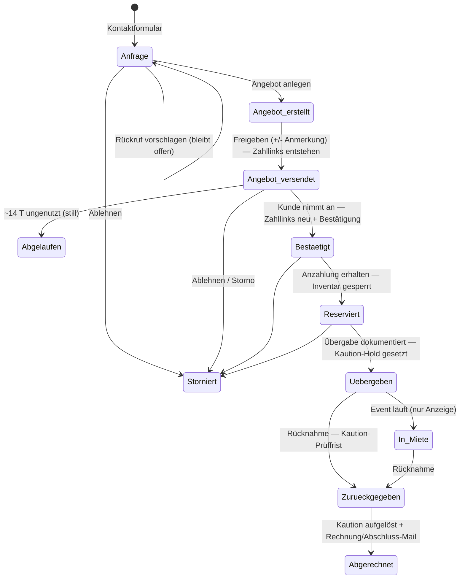
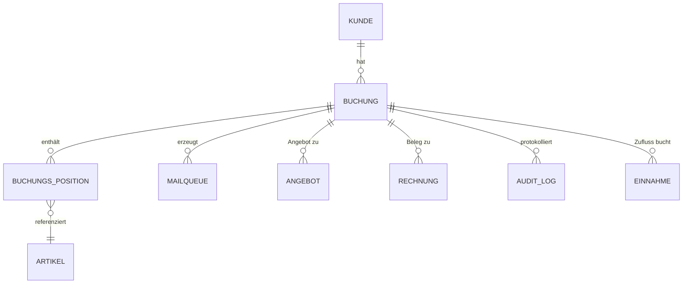

# Eventverleih Bergstraße — Betriebshandbuch (Dashboard & Mail-System)

> **Zweck.** Eine Quelle der Wahrheit dafür, *wann welche E-Mail* an den Kunden geht, *wer sie auslöst* (Klick oder Automatik) und *wo im Code* sie lebt. Teil A erklärt das in Alltagssprache (für Manuel / Dashboard). Teil B ist die Code-Landkarte (für Hermes), damit Mail-Änderungen nicht jedes Mal eine Komplett-Suche brauchen.
>
> **Stand:** 2026-06-24. Beschreibt den **Repo-Code**. Drift-Check: `python3 scripts/handbuch_drift_check.py` vergleicht das Mail-Inventar (Teil B) gegen die echten `Template_Key`s im Code (MailQueue-Mails). Die finale n8n-Direkt-Mail (Rechnung/Abschluss, `eve-rechnung-render-mail`) hat **keinen** Template_Key und liegt außerhalb des Checks — separat pflegen.
>
> ⚠️ **Drift-Warnung:** Produktion lief in der Vergangenheit Code, der in keinem lokalen Commit stand (Mail-Betreffe, die nirgends im Repo auffindbar waren). Wenn eine real zugestellte Mail von diesem Dokument abweicht: nicht annehmen Repo == Prod. Mit `git grep "<Betreff>" $(git rev-list --all)` über *alle* Commits suchen und gegen die **Live-Baserow-Rows** (Tabelle MailQueue) prüfen.
>
> 🔧 **Wartungsregel (wichtig):** Wird eine Mail geändert, hinzugefügt oder entfernt → **die Tabelle in Teil B im selben Commit mitpflegen.** Genau das spart künftig die Code-Sucherei.
>
> 📎 **Verwandte Dokumente (eigene Quellen, hier nur verlinkt):** Corporate-Design / Brand-Guide (Logo, Farben, Fonts — eigenes Dokument) · Decision-Log (Warum-Entscheidungen) · Inhalts-Vorlagen als „edit → live"-Daten (Mail-Texte, Mietvertrag, AGB, Datenschutz, FAQ, Rechnungs-/Angebots-Layout). Diese Texte gehören NICHT ins Handbuch dupliziert — das Handbuch sagt nur, wo sie leben.

---

## Teil A — Was passiert wann? (für Manuel)

### Die vier Sendemodi

Jede Mail liegt zuerst in der **MailQueue** (Baserow). Wie sie von dort rausgeht, steuert das Feld `Approval_Status`:

| Modus | Was es bedeutet |
|---|---|
| **`Pending`** | Wartet auf **deine** Freigabe im Dashboard-Backoffice. Geht erst raus, wenn du auf „freigeben" klickst. |
| **`Auto_Reply`** | Geht **sofort** raus — der n8n-Poll `eve-mailqueue-poll` holt die Queue ~jede Minute ab. Keine Freigabe nötig. |
| **`Approved`** | Folge einer Aktion von dir (z. B. „Angebot freigeben"): die Aktion *ist* die Freigabe → geht sofort raus. |
| **`Rejected`** | Abgelehnt, wird nie versendet. |

Faustregel: **`Pending`** = „ich schaue nochmal drüber" · **`Auto_Reply`/`Approved`** = „läuft automatisch, ich muss nichts tun".

### Der Lebenszyklus einer Buchung (Zeitstrahl)

Status-Feld der Buchung: `Status_Erweitert`. Werte:
`Anfrage → Angebot_versendet → Bestaetigt → Reserviert → Uebergeben → (In_Miete) → Zurueckgegeben → Abgerechnet`.
Seitenpfade: `Abgelaufen` (Angebot verstrichen), `Storniert`, `No_Show`.

```
①  ANFRAGE
    Kunde füllt Website-Formular aus
    → Auto: Eingangsbestätigung an den Kunden
    Du im Dashboard: Angebot freigeben | mit Anmerkung | Rückruf vorschlagen | ablehnen

②  ANGEBOT VERSENDET
    Du klickst „Angebot freigeben + Mail senden"
    → Mail: Angebot an Kunden
    → Dabei entstehen bereits die Stripe-Zahllinks (Anzahlung/Rest/Komplett); der Kaution-Hold kommt erst später.
    Bleibt aktiv bis Annahme ODER Eventdatum verstreicht.
    Läuft es ungenutzt ab → STILL (keine Kundenmail).
    Nach ~10 Tagen ohne Reaktion: Button „Nachhaken" (NICHT Angebot 1:1 neu schicken).
    Preise/Daten geändert? → „Neue Version" verschickt aktualisiertes Angebot.

③  ANZAHLUNG / BESTÄTIGT → RESERVIERT
    Kunde zahlt Anzahlung (Stripe) oder du erfasst Überweisung manuell
    → Auto: „Anzahlung erhalten — Ihr Termin ist reserviert"
    (Komplettzahlung möglich → Auto: „Zahlung erhalten — vollständig bezahlt")
    Erst ab Anzahlung sind die Artikel reserviert.
    Cron schickt ggf. Anzahlungs-Reminder (T-14/-7/-3 vor Event, oder 3 Tage nach Bestätigung) — als Pending, du gibst frei.

④  VOR DEM TERMIN
    Kaution-Hold-Link: manuell (Button) oder Auto-Cron (T-5 vor Event) → Auto
    Restzahlungs-Info (T-3) → Auto
    Termin-Erinnerung Übergabe (T-1) → Auto
    1 Stunde vor Übergabe „Gleich: Ihr Termin um …" → Auto (Schedule alle ~15 Min)

⑤  ÜBERGABE
    Du dokumentierst Übergabe (Fotos + Checkliste) im Dashboard
    → Auto: „Übergabe erfolgt — Ihre Mietartikel"
    Status: Uebergeben (ggf. In_Miete)

⑥  VOR / BEI RÜCKGABE
    Termin-Erinnerung Rückgabe (T-1) → Auto
    1 Stunde vor Rückgabe → Auto
    Du dokumentierst Rückgabe → Status: Zurueckgegeben

⑦  KAUTION (intern, KEINE eigene Mail — seit 2026-06-24)
    Du prüfst Kaution + Schäden (Prüffrist ~1–2 Tage).
    Button „Kaution erstatten" (voll / Teilerstattung / Kompletter Einzug):
      · voll  → Stripe-Hold wird freigegeben (idempotent gegen bereits verfallene Holds), 0 € abgebucht.
      · teil/einzug → Schaden wird captured, Rest verfällt.
      · Verschickt KEINE eigene Kundenmail; die Kaution-Info steht in den Buchungs-Feldern
        (Kaution_Pruefung_Status, _Rueckzahlung_Eur, Schaden_Betrag_Eur, _Schaden_Notiz)
        und wird von der Abschluss-Mail in ⑧ aufgegriffen.
    Bar-Kaution ohne Stripe-Hold: „IBAN anfordern" (Pending) → du überweist manuell per Bank-App.
    Status: Abgerechnet

⑧  ABSCHLUSS-MAIL — Rechnung + Kaution + Bewertung in EINER Mail
    Button „Rechnung erstellen + Mail senden" (du löst sie bewusst aus).
    → n8n eve-rechnung-render-mail: Rechnungs-/Beleg-PDF (benannt `RG-<Nr>.pdf`)
      + Kaution-Status + Google-Bewertungsbitte. Erfüllt den Wunsch „eine warme Abschluss-Mail".
    Timing-Gate: Kaution zuerst auflösen (⑦), dann Abschluss-Mail — nie Bewertung bei offener Kaution.
```

### Lebenszyklus als Zustandsdiagramm



Hinweis: `In_Miete` ist nur eine **Anzeige** (Event läuft gerade, datumsbasiert) — es gibt dafür keinen eigenen Status-Umschalt-Schritt im Code. Manuel kann jeden Status zur Not auch direkt über das Status-Panel setzen.

### Zahllinks & Kaution-Hold — wann entstehen sie

Wichtiger Schritt, der im reinen Status-Bild fehlt:

- **Anzahlungs-, Restzahlungs- und Komplettzahlungs-Link** entstehen **zweimal** automatisch: (1) wenn du das **Angebot freigibst** (`/api/admin/anfrage/[id]/action`), (2) erneut, wenn der **Kunde annimmt** (`/api/vertrag-akzeptieren`, fail-soft). Jederzeit auch manuell über das Stripe-Links-Panel (`/api/admin/buchung/[id]/payment-link`). Felder: `Stripe_Anzahlung_Link`, `Stripe_Restzahlung_Link`, `Stripe_Komplettzahlung_Link`. Bezahlt → Webhook `payment_intent.succeeded` → Status `Reserviert` + Einnahme.
- **Kaution-Hold-Link (Pre-Auth)** entsteht NICHT bei Angebot/Annahme, sondern **später**: bei der **Übergabe** (Methode „stripe_preauth"), per manuellem Button „Kaution-Hold senden" (`/api/admin/buchung/[id]/kaution-mail`), per **Cron** `kaution-reminder` (~T-5) oder manuell übers Payment-Links-Panel (`type:kaution`). Feld `Stripe_Kaution_Link`; Webhook `amount_capturable_updated` setzt `Stripe_Kaution_PaymentIntent` + `Kaution_Hinterlegt_am`. Auflösung später über „Kaution auflösen" (cancel = voll zurück / capture = Schaden).

### Dauerhafte Geschäftsregeln (gelten projektweit)

- **Kaution = durchlaufender Posten / Sicherheit, KEINE Einnahme.** Nie auf die Mietrechnung, nie abgezogen. Schäden separat über die Kaution, nicht über die Mietsumme.
- **Refund-Methode folgt der Zahlungsmethode.** Stripe-bezahlt → Stripe-Refund (Button löst Auto-Mail aus). Bar/Überweisung → manuelle (Termin-)Überweisung, **nie** Stripe-Refund.
- **Zahlungsgebühren nie an den Kunden weitergeben** (§270a BGB). Entfällt eine bezahlte Leistung → volle Differenz erstatten, ohne Gebühren-Abzug.
- **Rechnung nach der Rückgabe** (Leistung erbracht), **entkoppelt** von der Kautionsrückzahlung — nicht darauf warten.
- **Offene Kautionsrückzahlung = Buchung gilt NICHT als abgeschlossen** (bleibt offene Aktion bis erstattet).
- **Angebot läuft still ab** (keine „Angebot abgelaufen"-Mail). Gültigkeit ~14 Tage. Nachhaken erst nach ~10 Tagen, „erneut senden" nur Ausnahme.
- **Mail-Ton:** Erfolgsfall (volle Erstattung) warm + persönlich inkl. Bewertungsbitte; Schadensfälle (Teil/Einzug) sachlich-neutral. Stil-Grundregeln (`schreibstil-manu`) immer durchsetzen.
- **Keine Auto-Kundenmail aus Einzelaktionen** (seit 2026-06-24): Kundenmail bewusst über „Rechnung erstellen + Mail senden", nicht als Nebeneffekt eines Buttons.

### Aktionen & Buttons (Entscheidungsfläche)

Was Manuel im Dashboard auslösen kann — das ist die Fläche, auf die du zeigst, wenn du etwas ändern willst. Je Aktion: was sie tut + welche Optionen.

- **Anfrage/Angebot:** Angebot freigeben · freigeben **mit Anmerkung** (Text an Kunden) · **Rückruf vorschlagen** (Status bleibt Anfrage, keine Zahllinks) · **Ablehnen** (→ Storniert, höfliche Absage je Grund-Kategorie: ausgebucht / Liefergebiet / nicht verfügbar / kurzfristig / sonstiges; optional ohne Mail) · Erneut senden · Nachhaken (ab ~T+10) · Neue Version.
- **Termin:** Übergabe-/Rückgabe-Termin setzen (Bestätigungs-Mail + Google-Kalender-Sync) · Event-Datum ändern.
- **Zahlung & Links:** Zahlung erfassen (Bar/Überweisung; Anzahlung/Restzahlung/Kaution) · Stripe-Zahllink erzeugen/erneuern (Anzahlung/Rest/Komplett) · **Kaution-Hold senden** (Pre-Auth-Checkout).
- **Übergabe/Rücknahme:** Übergabe dokumentieren (Fotos + Checkliste, **Kaution-Methode wählen:** Stripe-Hold / Bar / EC / keine) · Rücknahme dokumentieren (öffnet die Kaution-Prüffrist).
- **Position/Leistung:** Position entfernen · Service entfernen (Lieferung/Abholung/Aufbau/Abbau) → Beträge über `recalcBuchung` neu.
- **Kaution auflösen:** voll (Hold zurück) / Teilerstattung (Schadenbetrag) / Kompletter Einzug — intern, keine eigene Mail · IBAN anfordern (bei Bar-Kaution).
- **Abschluss:** Rechnung erstellen + Mail senden → die EINE finale Mail (Rechnung-PDF + Kaution-Status + Bewertung).
- **Storno / Status:** Storno (Kunde im Member-Bereich oder Backoffice, optional Stripe-Refund) · Status zur Not manuell setzen (Status-Panel).
- **Liste:** Buchungen-Tab öffnet auf „Aktiv" (zu-erledigen zuerst; offene Kaution + Guthaben inklusive); Guthaben-Badge „Guthaben X € — Rückzahlung offen" bei Überzahlung (Rückzahlung manuell).

---

## Teil B — Code-Landkarte (für Hermes)

### MailQueue-Mechanik

- **Baserow-Tabelle:** `MailQueue` = **969** (definiert in `src/lib/baserow/client.ts`, Konstante `TABLES`).
- **Schreiben:** Routen/Reminder legen eine Row mit `createRow(TABLES.MailQueue, { Template_Key, Approval_Status, … })` an. Idempotency-Key (Buchungs-ID + Template + ggf. Datum/Suffix) verhindert Doppel-Versand; manuelle Erfassung und Stripe-Webhook teilen sich denselben Key.
- **Versenden:** n8n-Schedule **`eve-mailqueue-poll`** holt die Queue ~jede Minute ab und versendet alles mit `Auto_Reply`/`Approved`. `Pending` bleibt liegen bis Freigabe über `POST /api/admin/mailqueue/[id]/approve` (bzw. `…/reject`).
- **Texte:** Betreff + Body liegen derzeit **inline** in der jeweiligen Route/Reminder-Datei (kein zentrales Template-Verzeichnis). Bei Text-Änderung also in der unten genannten Datei:Zeile editieren.

### Stripe-Webhook — erforderliche Events (Dashboard-Config!)

- **Endpoint:** `https://eventverleih-bergstrasse.de/api/stripe/webhook` (Handler `src/app/api/stripe/webhook/route.ts`). **Kein** programmatisches Setup im Repo — die abonnierten Events werden **manuell im Stripe-Dashboard** gepflegt. Beim Neuaufsetzen/Key-Wechsel müssen daher ALLE folgenden Events am Endpoint aktiviert sein, sonst läuft der jeweilige Handler-Zweig nie:
  | Event | Wofür | Folge bei Fehlen |
  |---|---|---|
  | `payment_intent.succeeded` | Anzahlung/Rest/Komplettzahlung verbuchen | Zahlung kommt nicht im System an |
  | `payment_intent.amount_capturable_updated` | **Kaution-Hold platziert** → `Stripe_Kaution_PaymentIntent` + `Kaution_Hinterlegt_am` setzen | Hold liegt in Stripe (`requires_capture`), bleibt aber in Baserow unsichtbar; „Kaution erstatten/einbehalten" findet die PI nicht |
  | `payment_intent.canceled` | Kaution-Hold-Abbruch | Stornierter Hold nicht reflektiert |
  | `charge.refunded` | Storno-Refund-Marker | Refund nicht markiert |
- **Vorfall 2026-06-19:** `amount_capturable_updated` war **nicht** aboniert → alle je platzierten Kautions-Holds (B16, B27) blieben in Baserow leer. Event nachträglich abonniert; B16/B27 manuell nachgetragen. Bei „Kaution wird nicht angezeigt" zuerst hier prüfen.
- **Diagnose Kaution-Hold (Stripe):** Hold = PaymentIntent mit `capture_method: manual`, erscheint **nicht** als Einnahme, sondern unter Payments als `requires_capture`/„Nicht erfasst". Suche: PaymentIntent-Search `status:'requires_capture'` bzw. `metadata['buchung_id']:'<id>'` (Charges-Suche findet Holds NICHT). Stripe-Secret liegt nur in der **Vercel-Prod-Env** (nicht in Master-.env) → `vercel env pull` mit `VERCEL_TOKEN`.

### Einnahmen / Finanzen-Reiter (Zuflussprinzip, Modell A — ab 2026-06-19)

- **Finanzen-Reiter** (`/admin/finanzen`) liest ausschließlich Tabelle **Einnahmen (961)** + **Ausgaben (962)**, Jahres-gefiltert (Default = laufendes Jahr). Leer = es gibt keine Einnahmen-Rows fürs Jahr.
- **Regel:** Eine Einnahme entsteht beim **Geldzufluss** (§ 11 EStG), NICHT bei Rechnungserstellung. Gebucht über Helper `bucheEinnahme()` (`src/lib/eventverleih/einnahme.ts`), idempotent über Marker `[evt:B<buchungId>:<quelle>]` in `Notizen`.
  - Stripe-Webhook bucht Anzahlung/Restzahlung/Komplettzahlung (quelle = PI-ID). **Kaution NICHT** (Hold = kein Zufluss).
  - Manuelle Zahlungserfassung (`…/buchung/[id]/zahlung`, Bar/Überweisung) bucht ebenso, pro Eingang (quelle = `<typ>-<erfasst_am>`, Teilzahlungen möglich).
  - `…/rechnung/[id]/bezahlt` bucht nur noch als **Fallback** den noch ungedeckten Rest (`gebuchteEinnahmenSumme`) → keine Doppel-/Fehlbuchung bei gemischten Zahlungswegen.
  - **Kautions-Schaden-Einzug** (`kaution-erstatten` teil/einzug) bucht den einbehaltenen Betrag als Einnahme (Schadensersatz, quelle `schaden-<id>`).
  - **Erstattung/Storno** (`charge.refunded`-Webhook) bucht eine **negative Einnahme** (Gegenbuchung zur ursprünglichen Zahlung; quelle `refund-<chargeId>-<betrag>`, Delta-sicher bei Teil-Refunds). `Storno_Betrag_Eur` bleibt die Stornogebühr und wird NICHT überschrieben.
  - `bucheEinnahme()` erlaubt negative Beträge (Erstattung); Idempotenz weiterhin über den Notizen-Marker. Bekannte Grenze: Marker-Check ist nicht atomar (TOCTOU) — bei sehr seltener paralleler Webhook-Re-Delivery theoretisch Doppelbuchung; in der Praxis durch die vorgelagerten Status-Guards abgefangen.
- **Vorher-Bug (behoben 2026-06-19):** Einnahme entstand nur über „Rechnung als bezahlt markieren". Da Stripe-Vorkasse die Rechnung direkt mit Status „Bezahlt" anlegt, lief der Pfad nie → 2026-Einnahmen = 0 trotz echter Zahlungen. Bestand per Backfill aus den realen Zahlungen nachgetragen.

### Mail-Inventar (alle 30, nach Lebenszyklus-Phase)

Spalten: **Auslöser · Sendemodus · Datei:Zeile · `Template_Key` · Betreff**

#### Anfrage / Angebot
| Mail | Auslöser | Modus | Datei:Zeile | Template_Key |
|---|---|---|---|---|
| Eingangsbestätigung | Website-Formular `POST /api/contact` | `Auto_Reply` | `api/contact/route.ts:434` | `anfrage_eingang` |
| Angebot freigegeben | Aktion `freigeben` | `Approved` | `api/admin/anfrage/[id]/action/route.ts:206` | `angebot_freigegeben` |
| Angebot freigegeben + Anmerkung | Aktion `freigeben_anmerkung` | `Approved` | `api/admin/anfrage/[id]/action/route.ts:206` | `angebot_freigegeben_anmerkung` |
| Rückruf-Vorschlag | Aktion `rueckruf` | `Approved` | `api/admin/anfrage/[id]/action/route.ts:219` | `rueckruf_vorschlag` |
| Anfrage abgelehnt | Aktion `ablehnen` | `Approved` | `api/admin/anfrage/[id]/action/route.ts:224` | `anfrage_abgelehnt` |
| Angebot erneut gesendet | `POST …/angebot/[id]/erneut-senden` | `Approved` | `api/admin/angebot/[id]/erneut-senden/route.ts:131` | `angebot_erneut_gesendet` |
| Angebot nachhaken (~T+10) | `POST …/angebot/[id]/nachhaken` | `Approved` | `api/admin/angebot/[id]/nachhaken/route.ts:115` | `angebot_nachhaken` |
| Angebot neue Version | `POST …/angebot/[id]/neue-version` | `Approved` | `api/admin/angebot/[id]/neue-version/route.ts:123` | `angebot_aktualisiert` |
| Angebot angenommen — Bestätigung | Kunde nimmt an `POST /api/vertrag-akzeptieren` | `Auto_Reply` | `api/vertrag-akzeptieren/route.ts:418` | `vertrag_bestaetigung` |

#### Zahlung
| Mail | Auslöser | Modus | Datei:Zeile | Template_Key |
|---|---|---|---|---|
| Anzahlung erhalten | Stripe-Webhook `payment_intent.succeeded` (anzahlung) **oder** manuelle Erfassung `…/buchung/[id]/zahlung` | `Auto_Reply` | `lib/eventverleih/zahlungsbestaetigung.ts:35` | `anzahlung_erhalten` |
| Komplettzahlung erhalten | Stripe-Webhook (komplettzahlung) | `Auto_Reply` | `api/stripe/webhook/route.ts:113` | `komplettzahlung_erhalten` |
| Restzahlung erhalten | Stripe-Webhook (restzahlung) | `Auto_Reply` | `api/stripe/webhook/route.ts:257` | `restzahlung_erhalten` |

#### Reminder (Cron-gesteuert)
| Mail | Auslöser | Modus | Datei:Zeile | Template_Key |
|---|---|---|---|---|
| Anzahlungs-Reminder T-14 | Cron `restzahlung-reminder` | `Pending` | `lib/eventverleih/anzahlung-reminder.ts:186` | `anzahlung_pre14` |
| Anzahlungs-Reminder T-7 | Cron `restzahlung-reminder` | `Pending` | `lib/eventverleih/anzahlung-reminder.ts:186` | `anzahlung_pre7` |
| Anzahlungs-Reminder T-3 | Cron `restzahlung-reminder` | `Pending` | `lib/eventverleih/anzahlung-reminder.ts:186` | `anzahlung_pre3` |
| Anzahlungs-Reminder T+3 n. Bestätigung | Cron `restzahlung-reminder` (Status=Bestaetigt) | `Pending` | `lib/eventverleih/anzahlung-reminder.ts:186` | `anzahlung_post3` |
| Restzahlung-Info T-3 | Cron `restzahlung-reminder` (Status=Reserviert) | `Auto_Reply` | `api/cron/restzahlung-reminder/route.ts:168` | `restzahlung_pre3` |
| Termin-Erinnerung Übergabe T-1 | Cron `restzahlung-reminder` (Sub-Pass) | `Auto_Reply` | `lib/eventverleih/termin-reminder.ts:156` | `termin_erinnerung` |
| Termin-Erinnerung Rückgabe T-1 | Cron `restzahlung-reminder` (Sub-Pass) | `Auto_Reply` | `lib/eventverleih/termin-reminder.ts:214` | `rueckgabe_erinnerung` |
| Termin 1 h vor Übergabe | Cron `termin-1h-reminder` (~alle 15 Min) | `Auto_Reply` | `api/cron/termin-1h-reminder/route.ts:111` | `termin_1h_uebergabe` |
| Termin 1 h vor Rückgabe | Cron `termin-1h-reminder` | `Auto_Reply` | `api/cron/termin-1h-reminder/route.ts:111` | `termin_1h_rueckgabe` |
| Bewertungsbitte (Google) | Cron `kaution-reminder` Sub-Pass `runReviewReminder` (3–10 T nach Event) | `Pending` | `lib/eventverleih/review-reminder.ts:99` | `google_review` |

#### Termin / Übergabe
| Mail | Auslöser | Modus | Datei:Zeile | Template_Key |
|---|---|---|---|---|
| Übergabe-Termin bestätigt | `POST …/buchung/[id]/termin` (uebergabe_termin) | `Approved` | `api/admin/buchung/[id]/termin/route.ts:103` | `termin_uebergabe_bestaetigung` |
| Rückgabe-Termin bestätigt | `POST …/buchung/[id]/termin` (rueckgabe_termin) | `Approved` | `api/admin/buchung/[id]/termin/route.ts:103` | `termin_rueckgabe_bestaetigung` |
| Übergabe erfolgt | `POST …/buchung/[id]/uebergabe` | `Auto_Reply` | `api/admin/buchung/[id]/uebergabe/route.ts:152` | `uebergabe_erfolgt` |

#### Kaution
| Mail | Auslöser | Modus | Datei:Zeile | Template_Key |
|---|---|---|---|---|
| Kaution-Hold-Link | `POST …/buchung/[id]/kaution-mail` (manuell) **oder** Cron `kaution-reminder` (T-5) | `Auto_Reply` | `lib/eventverleih/kaution-mail.ts:124` | `kaution_hold_link` |
| Kaution IBAN anfordern (Bar) | `POST …/buchung/[id]/kaution-iban-anfordern` | `Approved` | `api/admin/buchung/[id]/kaution-iban-anfordern/route.ts:77` | `kaution_iban_anfordern` |

> **Hinweis (2026-06-24):** Die früheren Kaution-Erstattungs-Mails (`kaution_rueckzahlung`/`_teilerstattung`/`_einzug`) sind **entfernt**. „Kaution auflösen" ist jetzt rein intern; die Kaution-Info läuft über die Abschluss-Mail (siehe nächster Abschnitt).

#### Abschluss / Rechnung (n8n-Direktversand — NICHT MailQueue, kein Template_Key)
| Mail | Auslöser | Modus | Pfad | Hinweis |
|---|---|---|---|---|
| Rechnung + Beleg-PDF | Button „Rechnung erstellen + Mail senden" → `createRechnungForBuchung(sendMail:true)` | n8n-Direkt | n8n `eve-rechnung-render-mail` (Webhook `N8N_RECHNUNG_PDF_URL`) | PDF benannt `RG-<Nr>.pdf` (Node „PDF benennen"); enthält **Kaution-Status** + **Google-Bewertungsbitte**. Liegt außerhalb des Drift-Checks. |

#### Sonstiges / Member
| Mail | Auslöser | Modus | Datei:Zeile | Template_Key |
|---|---|---|---|---|
| Storno-Bestätigung | `POST /api/member/buchung/[id]/storno` (Kunde) | `Auto_Reply` | `api/member/buchung/[id]/storno/route.ts:126` | `storno_bestaetigung` |
| Login Magic-Link | `POST /api/member/login-link` | `Auto_Reply` | `api/member/login-link/route.ts:56` | `login_magic_link` |

### Status-Felder (Buchung)

- **Haupt-Status:** `Status_Erweitert` → `Anfrage · Angebot_versendet · Abgelaufen · Bestaetigt · Reserviert · Uebergeben · In_Miete · Zurueckgegeben · Abgerechnet · Storniert · No_Show`
- **Termine:** `Uebergabe_Termin`, `Rueckgabe_Termin` (ISO-DateTime)
- **Zahlung:** `Anzahlung_Bezahlt_am/_Eur`, `Restzahlung_Bezahlt_am/_Eur`
- **Kaution:** `Kaution_Soll_Eur`, `Kaution_Hinterlegt_am`, `Kaution_Rueckzahlung_am`, `Stripe_Kaution_PaymentIntent`, `Kaution_Pruefung_Status`, `Kaution_Prueffrist_bis`
- **Schaden:** `Schaden_Betrag_Eur`, `Schaden_Dokumentiert_am`
- **Storno:** `Storno_am`, `Storno_Stufe`, `Storno_Betrag_Eur`, `Storno_Grund`
- **Engpass-Flag:** `Konflikt_Mit_Buchung_ID`

### Daten-Landkarte (Entitäten + Verknüpfungen)

Konzeptionelle Karte — Tabellen-IDs + Beziehungen, NICHT die vollständigen Felder (die leben in Baserow; nur logik-treibende Felder stehen unter „Status-Felder").



Tabellen (Baserow): Kunden 949 · Rechnungen 950 · Buchungen 951 · Angebote 952 · EmailLog 953 · System_Konfiguration 955 · Artikel 957 · Einnahmen 961 · Buchungs_Position 968 · MailQueue 969 · Audit_Log 970. Kern: alles hängt an der **Buchung (951)**; Mietsumme + Kaution-Soll werden aus den Positionen (`Buchungs_Position` → `Artikel`) per `recalcBuchung` berechnet.

### Integrationen & Secrets-Landkarte

Welche externen Dienste, was sie tun, WO die Keys liegen — **nie die Keys selbst**.

- **Baserow** (Datenbank) — Host `baserow.mb-smartsystems.de`; Token `BASEROW_TOKEN` (Vercel-Env + master-.env).
- **Stripe** (Zahlung + Kaution-Hold) — Webhook-Events siehe oben; Secret nur in der Vercel-Prod-Env.
- **n8n** (Mailversand, PDF, Kalender) — Workflows u. a. eve-mailqueue-poll, eve-rechnung-render-mail, eve-calendar-sync, eve-termin-1h-reminder; Webhook-URLs als Vercel-Env (`N8N_RECHNUNG_PDF_URL`, `N8N_CALENDAR_SYNC_URL`).
- **Gotenberg** (HTML→PDF) — intern vom n8n-Rechnungs-Workflow aufgerufen.
- **Google Calendar** — Übergabe-/Rückgabe-Termine via n8n (`GCAL_EVENTVERLEIH_ID`).
- **SMTP/Mailversand** — über n8n-Credential (der eigentliche Versand-Kanal).

### Verfügbarkeits-/Konflikt-Logik

Inventar wird **hart geblockt** bei Status Reserviert / Uebergeben / In_Miete (`src/lib/eventverleih/availability.ts`, `conflicts.ts`). „Reserviert" gilt erst **nach Anzahlung**. Artikel-Bestände sind endlich → Verfügbarkeit über `POST /api/availability` prüfen. Engpass wird über `Konflikt_Mit_Buchung_ID` markiert.

### Automatik-Landkarte (was läuft von selbst)

Alles, was OHNE Mensch feuert — drei Quellen:
- **Vercel-Crons** → siehe Cron-Map unten (Restzahlung-/Kaution-/1h-Reminder mit Sub-Passes).
- **Stripe-Webhooks** → siehe Stripe-Webhook-Tabelle oben (Zahlung verbuchen, Kaution-Hold setzen, Refund markieren).
- **n8n-Schedules/Webhooks:** eve-mailqueue-poll (~1 Min, versendet Auto_Reply/Approved) · eve-termin-1h-reminder (~15 Min) · eve-calendar-sync (Termin → Kalender) · eve-rechnung-render-mail (auf Knopf „Rechnung erstellen").
- **Faustregel:** Kundenmail-Versand passiert ausschließlich über eve-mailqueue-poll (MailQueue) bzw. die finale n8n-Rechnungs-Mail.

### Rollen & Zugriff

- **Backoffice/Admin** (Manuel): volles Dashboard unter `/admin/*` (Auth über `EVENTVERLEIH_ADMIN_PASSWORT`).
- **Kunde/Member:** `/mein-bereich` (Magic-Link-Login) — eigene Buchung einsehen, Storno.
- **Public:** Website + Token-Links (`/angebot/[token]`, `/vertrag/[token]`, `/rechnung/[token]`).

### Cron-Map (Vercel Hobby-Limit → wenige Crons mit Sub-Passes)

| Cron-Route | Takt | löst aus |
|---|---|---|
| `api/cron/restzahlung-reminder` | täglich ~07:30 | Restzahlung-Info + Sub-Passes: Anzahlungs-Reminder, Termin-Reminder (T-1), Angebots-Expiry |
| `api/cron/kaution-reminder` | täglich | Kaution-Hold (T-5) + Sub-Pass `runReviewReminder` (Bewertungsbitte) |
| `api/cron/termin-1h-reminder` | ~alle 15 Min (n8n) | 1-h-Mails Übergabe/Rückgabe |

Alle Sub-Passes laufen fail-soft (Fehler in einem killt nicht die anderen).

### Mail-Logik-Dateien (Direktsprung)

- `lib/eventverleih/zahlungsbestaetigung.ts` — Anzahlungs-Eingang
- `lib/eventverleih/anzahlung-reminder.ts` — 4 Anzahlungs-Reminder
- `lib/eventverleih/termin-reminder.ts` — Termin-Reminder T-1 (Übergabe + Rückgabe)
- `lib/eventverleih/kaution-mail.ts` — Kaution-Hold-Link
- `lib/eventverleih/review-reminder.ts` — Bewertungsbitte
- Freigabe/Ablehnung von `Pending`-Mails: `api/admin/mailqueue/[id]/approve|reject/route.ts`

### Neue Mail hinzufügen — Checkliste

1. `createRow(TABLES.MailQueue, { Template_Key: "<neu>", Approval_Status: "<Pending|Auto_Reply|Approved>", … })`.
2. Idempotency-Key setzen (Buchungs-ID + Template + ggf. Timestamp) → kein Doppel-Versand.
3. Neuer zeitgesteuerter Reminder → als `export async function run<Name>()` in `lib/eventverleih/`, dann als **Sub-Pass** in einen bestehenden Cron einbinden (Hobby-Plan-Limit, keine neue Cron-Route).
4. Betreff + Body inline in der Route/Reminder-Datei.
5. **Diese Tabelle in Teil B aktualisieren** (Wartungsregel).

---

## Teil C — Lücken im Ist-Zustand

Was die Geschäftslogik erwarten ließe, aber im Repo **nicht** existiert (Stand 2026-06-18) — rein deskriptiv, keine geplanten Features:

- ~~Keine dedizierte Rechnungs-Mail.~~ **Behoben 2026-06-24:** finale Abschluss-Mail (Button „Rechnung erstellen + Mail senden", n8n `eve-rechnung-render-mail`) = Rechnung/Beleg-PDF (`RG-<Nr>.pdf`) + Kaution-Status + Bewertungsbitte in EINER Mail.
- **Keine Mahnung / Zahlungserinnerung** bei ausbleibender Restzahlung (über die freundlichen Reminder hinaus).
- **Keine Rechnungskorrektur / Gutschrift-Mail.**

---

## Teil D — Runbook „Was tun wenn …"

- **Kaution wird nicht angezeigt:** Stripe-Event `amount_capturable_updated` abonniert? (Vorfall 2026-06-19). PaymentIntent per `requires_capture` / `metadata.buchung_id` in Stripe suchen, ggf. in Baserow nachtragen.
- **Mail kam nicht an:** MailQueue-Row prüfen — `Approval_Status` (Pending wartet auf Freigabe), läuft eve-mailqueue-poll? Self-Send-Falle (Absender = Empfänger-Postfach) übersehen?
- **Zahlung fehlt im System:** Stripe `payment_intent.succeeded` abonniert? Sonst manuell über „Zahlung erfassen" eintragen.
- **Finanzen-Reiter leer/falsch:** Einnahmen entstehen beim Zufluss (`bucheEinnahme`), nicht bei Rechnungserstellung; Jahres-Filter prüfen.
- **PDF-Anhang falsch benannt:** n8n eve-rechnung-render-mail, Node „PDF benennen" (`RG-<Nr>.pdf`).
- **Überzahlung / Guthaben:** Guthaben-Badge zeigt es; Rückzahlung manuell per Rücküberweisung (kein Stripe-Refund, wenn per Überweisung gezahlt wurde).
- **Kaution-Auflösen wirft Stripe-Fehler:** verfallener Hold = ok (idempotent); echter Fehler nur bei bereits eingezogenem (captured) Hold.
- **Handbuch weicht vom Code ab:** Drift-Check `python3 scripts/handbuch_drift_check.py` laufen lassen.
